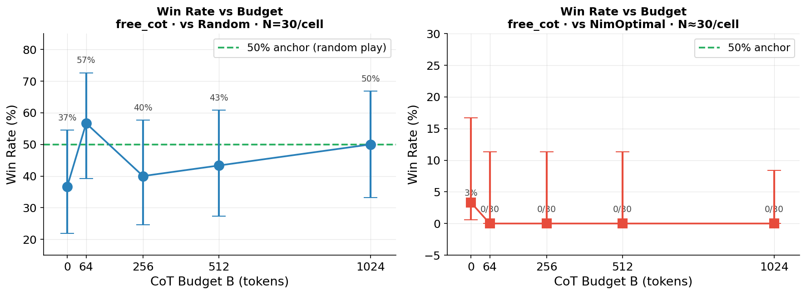
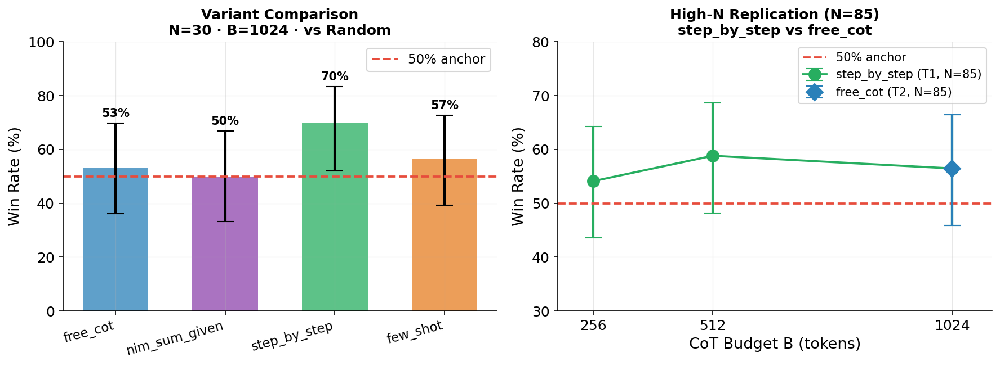
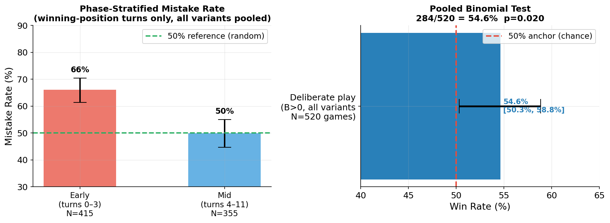
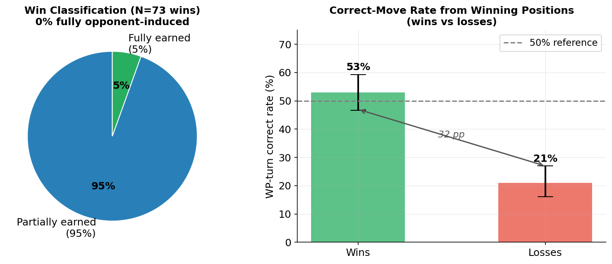

# CoT Budget as a Compute-Grounded Difficulty Knob for LLM Game Agents

**Stephone Christian** — stephone@stanford.edu  
CS 348K — Visual Computing Systems, Spring 2026

The full project proposal lives at [`docs/proposal.md`](docs/proposal.md).  
Architecture and build notes are at [`docs/architecture.md`](docs/architecture.md).  
Detailed Nim findings (all tables, traces, mechanism analysis) are at [`docs/nim_experiment_findings.md`](docs/nim_experiment_findings.md).

---

## What this project does

The project asks a simple question: if you give a language model more tokens to think before it acts in a game, does it play better? We call the token limit `B` — the **CoT budget** — and treat it as a dial that controls reasoning depth. The game is the oracle: win rate vs `B` gives a clean, automatic measure of whether more thinking helps.

We run the full experiment pipeline on **Nim [3,5,7]** (a solved combinatorial game with an exact optimal strategy) using **Llama 3.1 8B Instruct** served by SGLang. Nim is the pilot: it has a known closed-form solution, so we can measure model performance against both a random baseline (50% theoretical win rate) and a perfect opponent (0% win rate unless the model plays optimally).

The Nim results are complete and serve as a **negative control**. The project moves next to **Avalon**, where there is no closed-form optimal policy and the budget knob is expected to operate differently.

---

## Quick start

### 0. Set up the environment

```bash
# Clone and install Python deps
git clone <repo>
cd CoT-difficulty-knob
uv sync
```

### 1. Start the SGLang server (PC with GPU)

Requires an NVIDIA GPU with ≥16 GB VRAM. FP8 quantization is needed to fit Llama 3.1 8B.

```bash
CUDA_HOME=/usr/local/cuda-13.2 uv run python -m sglang.launch_server \
    --model-path meta-llama/Llama-3.1-8B-Instruct \
    --port 30000 --host 127.0.0.1 --quantization fp8
```

Wait for `"Server is ready"` before running experiments. See [`docs/pc_dev_setup.md`](docs/pc_dev_setup.md) for full setup instructions.

### 2. Validate the harness with the mock backend

```bash
uv run pytest -q                                         # unit tests (~45s)
uv run python scripts/run_budget_sweep.py configs/smoke_n3_mock.yaml
uv run python scripts/analyze_run.py <run_id>
```

This runs the full pipeline (config → sweep → SQLite → JSONL → plots) without any LLM server. The mock agent loses to UCT every game — that is expected.

### 3. Run a Nim sweep

```bash
uv run python scripts/run_budget_sweep.py configs/nim_vs_random_n30_sglang.yaml
uv run python scripts/analyze_run.py <run_id>
```

Each config file specifies the game, budgets, number of seeds per cell, opponent, and prompt variant. See `configs/` for all run configurations used in the paper.

### 4. Open the analysis notebooks

```bash
cd notebooks
uv run jupyter lab
```

- `06_nim_llama_sweep.ipynb` — main budget sweep: win rate vs `B`, token output vs budget, mistake rate on winning positions
- `07_nim_diagnostics.ipynb` — variant comparison, P1/P2 split, phase-stratified analysis, win trace classification, pooled binomial test, vs-optimal trace inspection

---

## Nim results (pilot, complete)

All experiments use Llama 3.1 8B Instruct, SGLang FP8, Nim [3,5,7], regex-constrained decoding. The theoretical random-play anchor is exactly **50.0%** (verified by game-tree recursion and N=100,000 Monte Carlo). We ran a sequence of experiments in a deliberate order — each one was motivated by an open question left by the one before it.

---

### Experiment 1 — Win rate vs budget (main sweep)

**Why we ran this.** This is the headline experiment of the whole project. We needed to know whether the budget knob `B` actually moves the win-rate needle at all. We played 30 games at each of five budgets against a random opponent — random is the right baseline because its win rate is exactly 50% by game-tree symmetry, giving us a clean anchor to test against. We also ran the same sweep against the NimOptimal agent (which always plays the nim-sum-correct move) to set an upper-bound ceiling: if the model ever wins against optimal play, it must have computed the strategy correctly at least once.

**What we learned.** The budget curve is flat. No single cell at N=30 is distinguishable from the 50% anchor — the confidence intervals are ±18 percentage points wide, and the point estimates zigzag around 50% with no upward trend. Against the optimal agent, the model wins 0 out of 132 games at B>0, with an upper CI bound of ~2%. Giving the model more tokens to think does not translate into better Nim play by any measurable amount at this sample size.



**Left:** free_cot vs random opponent, N=30/cell. No budget cell clears the 50% anchor — CIs are ±18 pp. **Right:** free_cot vs NimOptimal. The model wins 0 games at every budget above zero.

| Budget B | k/n | Win rate | 95% CI |
|----------|-----|----------|--------|
| 0 (random fallback) | 11/30 | 36.7% | [21.9%, 54.5%] |
| 64 | 17/30 | 56.7% | [39.2%, 72.6%] |
| 256 | 12/30 | 40.0% | [24.6%, 57.7%] |
| 512 | 13/30 | 43.3% | [27.4%, 60.8%] |
| 1024 | 15/30 | 50.0% | [33.2%, 66.8%] |

---

### Experiment 2 — Prompt variant comparison

**Why we ran this.** The flat budget curve left open the question of whether the model simply needed a better prompt. The nim-sum strategy is an explicit algorithm — XOR the pile sizes, then figure out which pile to reduce to bring the nim-sum to zero. Maybe the model just needs that algorithm handed to it. We tested four variants: free unstructured reasoning (`free_cot`), the nim-sum value given directly in the prompt (`nim_sum_given`), a step-by-step XOR procedure scaffolded in the system prompt (`step_by_step`), and a worked example of a complete game move (`few_shot`). N=30 per variant at B=1024.

**What we learned.** No variant moved the needle significantly. The most interesting result is `nim_sum_given` at exactly 50.0% — giving the model the correct XOR value directly does not help, which means the failure is not just in computing the XOR. The model also needs to invert it: given nim-sum=S and piles A,B,C, which pile do you reduce by how much to bring nim-sum to zero? That inverse mapping is a second failing step. `step_by_step` hit 70% at N=30, which looked promising, but the confidence interval included 50% (p=0.074) and the result did not survive replication at N=85 — see Experiment 3.



**Left:** N=30 variant comparison at B=1024. `step_by_step` reaches 70% but the CI is too wide to call it significant. **Right:** At N=85, the step_by_step budget gradient disappears and both variants converge to 56.5%.

| Variant | k/n | Win rate | 95% CI | p vs 50% |
|---------|-----|----------|--------|----------|
| `free_cot` | 16/30 | 53.3% | [36.4%, 69.6%] | ns |
| `nim_sum_given` | 15/30 | 50.0% | [33.2%, 66.8%] | ns |
| `step_by_step` | 21/30 | 70.0% | [52.1%, 83.3%] | ns (p=0.074) |
| `few_shot` | 17/30 | 56.7% | [39.2%, 72.6%] | ns |

---

### Experiment 3 — High-N replication (T1 and T2, N=85)

**Why we ran this.** N=30 gives ±18 pp confidence intervals, which is too wide to be confident in a 13 pp difference between variants. The `step_by_step` 70% result and a directional budget gradient within `step_by_step` (B=256→B=1024) could both be real signals or sampling noise — we needed more data to tell them apart. We chose N=85 because that gives 80% power to detect a 20 pp effect at p<0.05. T1 ran `step_by_step` at three budgets (B=256, 512, 1024) with N=85 each. T2 re-ran `step_by_step` and `free_cot` head-to-head at B=1024 with N=85.

**What we learned.** Both are negative. The budget gradient within `step_by_step` is flat — 54%, 59%, 56% across B=256, 512, 1024, none significantly different from each other or from 50%. The variant comparison is also flat: `step_by_step` and `free_cot` return identical point estimates (48/85 = 56.5% each). The N=30 step_by_step 70% was a lucky draw from a true rate closer to 57%.

| Condition | k/n | Win rate | 95% CI | p vs 50% |
|-----------|-----|----------|--------|----------|
| `step_by_step` B=256 | 46/85 | 54.1% | [43.6%, 64.3%] | ns |
| `step_by_step` B=512 | 50/85 | 58.8% | [48.2%, 68.7%] | ns |
| `step_by_step` B=1024 | 48/85 | 56.5% | [45.9%, 66.5%] | ns |
| `free_cot` B=1024 | 48/85 | 56.5% | [45.9%, 66.5%] | ns |

---

### Experiment 4 — Pooled binomial test

**Why we ran this.** Every individual cell is underpowered to detect a small effect. But we had 520 unique games across all conditions — if there is any consistent signal above 50%, pooling them gives enough power to detect it. This is the single cleanest claim we can make: does the model, under any deliberate-play condition, perform above chance?

**What we learned.** Yes, marginally. Across all 520 B>0 vs-random games (four variants, N=30 and N=85, duplicates excluded), the model wins 284/520 = 54.6%, with a 95% CI of [50.3%, 58.9%] and a one-sided p of 0.020. The effect is real but small — +4.6 pp above chance. It is consistent across all contributing groups; no single variant or budget level drives it. This is the weakest possible form of "above chance" and should not be over-interpreted: the model is not playing strategically, it just makes correct moves slightly more often than random.

> **284/520 = 54.6%** &nbsp; 95% CI [50.3%, 58.9%] &nbsp; one-sided p = **0.020**

---

### Experiment 5 — Phase-stratified mistake rate

**Why we ran this.** The pooled 54.6% is a game-level number. We wanted to know where inside the game the model's above-chance performance comes from — is it concentrated in the opening, middle game, or endgame? If the signal is phase-localised it tells us something about the mechanism. We split all winning-position turns (turns where a correct move existed) by game phase — early (turns 0–3), mid (turns 4–11), late (12+) — and measured the fraction the model blundered away.

**What we learned.** The result is striking: the model is actively worse than random in the early game (66% mistake rate, p<0.001) and essentially random in the mid-game (50%). Opening turns have the largest pile sizes — three piles of 3, 5, and 7 — which means the XOR arithmetic involves three multi-bit numbers and is at its most complex. As stones are removed and piles shrink, the arithmetic simplifies and the model's mistake rate drifts down to chance. Games on Nim [3,5,7] never reach the late phase (there are only 15 stones total). The pooled +4.6 pp win-rate elevation comes entirely from the mid-game, partially cancelling the early-game degradation.



**Left:** Early game (turns 0–3): 66% mistake rate — worse than random because XOR is hardest when piles are full. Mid game (turns 4–11): 50% — indistinguishable from chance as arithmetic simplifies. **Right:** Pooled across all 520 deliberate-play games, the model sits at 54.6% with CI [50.3%, 58.9%], just clearing the 50% anchor.

| Phase | Mistakes/turns | Mistake rate | 95% CI | p vs 50% |
|-------|----------------|--------------|--------|----------|
| Early (turns 0–3) | 274/415 | **66.0%** | [61.3%, 70.4%] | p<0.001 |
| Mid (turns 4–11) | 177/355 | **49.9%** | [44.7%, 55.0%] | ns |
| Late (turns ≥12) | 0/0 | — | — | — |

---

### Experiment 6 — Win trace analysis

**Why we ran this.** The 54.6% pooled win rate raises a natural concern: maybe the model isn't actually winning because of good play. A random opponent makes mistakes too, and the model might simply be the last player standing after the opponent blunders enough games away. To check this, we went through all 73 wins the model achieved and asked: did the model actually have a winning position during that game, and did it choose the right move from it? If most wins contain no winning positions at all, the elevation is opponent-induced noise, not model skill.

**What we learned.** The wins are not purely opponent-induced, but they are also not deeply earned. Zero games were fully opponent-induced — every single win contained at least one winning position that the model correctly exploited. 95% of wins were partially earned (the model made at least one correct move from a winning position) and 5% were fully earned (every winning-position move was correct). More tellingly, the model's correct-move rate from winning positions is 53% in games it wins versus 21% in games it loses — a 32 pp gap. Wins genuinely correlate with better play. But 53% in winning games is barely above the 50% random baseline, confirming that the model gets lucky on a near-random mid-game move and the game tips from there, not that it is executing a coherent strategy.



**Left:** Every win had at least one correctly exploited winning position — 0% were purely gifted by the opponent. **Right:** In winning games the model plays correctly from winning positions 53% of the time; in losing games, only 21%. The 32 pp gap shows wins and correct play are linked, but 53% is still barely above chance.

---

### Experiment 7 — Mechanism: reading the loss traces

**Why we ran this.** Aggregate win rates tell you that the model fails but not how. Two very different failure modes — "the model ignores strategy entirely" vs "the model knows the strategy but can't execute the arithmetic" — would both produce 0% wins against an optimal opponent. The fix for the first is a better prompt; the fix for the second is nothing we can do with a prompt. We read five B=1024 loss traces from games against the NimOptimal agent and annotated every reasoning step.

**What we learned.** The failure is arithmetic, not strategic. At every turn, without exception, the model: names the nim-sum algorithm, correctly identifies XOR as the operation, converts pile sizes to binary, and frames its goal as "find a move that sets nim-sum to zero." It is not ignoring the strategy. The failure is that it consistently gets the XOR wrong for mid-game pile sizes: `2 ⊕ 5 ⊕ 2 = 7` (correct answer: 5), `2 ⊕ 1 ⊕ 7 = 6` (correct: 4), `1 ⊕ 5 ⊕ 1 = 7` (correct: 5). Importantly, adding more tokens at B=1024 does not fix this — it only produces more text re-deriving the same wrong answer. The model cannot self-verify its own XOR computations. One trace also shows the model hallucinating a move that never happened, illustrating that multi-turn context tracking also degrades under pressure.

> **Strategy-known, arithmetic-failed.** The model names the nim-sum algorithm, writes binary representations, and frames the goal correctly at every turn. It fails because it consistently misevaluates `a XOR b XOR c` for mid-game pile configurations. For example: `2 ⊕ 5 ⊕ 2 = 7` (correct: 5), `2 ⊕ 1 ⊕ 7 = 6` (correct: 4). Longer CoT at B=1024 produces more reasoning tokens but the arithmetic remains wrong — the model cannot self-verify XOR computations. In one trace, the model hallucinates a game move that never occurred.

---

## Repository layout

```
src/cot_knob/
├── llm/         # LLMClient ABC + MockClient + OllamaClient + SGLangClient
├── games/       # Nim state + Reversi state + GameState protocol
├── agents/      # LLMAgent (two-pass: reason → constrained MOVE tag), UCTAgent
├── memory/      # FullHistoryMemory, LastMoveMemory
├── prompts/     # Nim prompt templates (free_cot, nim_sum_given, step_by_step, few_shot)
├── experiments/ # SweepConfig (pydantic), runner (single match), sweep (config-driven)
├── tracking/    # SQLite Store, JSONLWriter, analytics queries
└── analysis/    # plotting helpers
```

The serving backend lives entirely in `src/cot_knob/llm/`. Everything else is platform-agnostic. Swap `OllamaClient` for `SGLangClient` in configs; the game harness and sweep logic do not change.

---

## Where results live

- `data/results.db` — normalised SQLite source of truth (runs, trials, turns, model_calls)
- `data/runs/<run_id>/*.jsonl` — append-only per-trial event log (raw backup)
- `notebooks/06_nim_llama_sweep.ipynb` — main budget sweep analysis
- `notebooks/07_nim_diagnostics.ipynb` — variant, phase, mechanism, and pooled analyses

Schema reference: [`docs/tracking_schema.md`](docs/tracking_schema.md).

---

## Status and next steps

Nim is complete and serves as a **negative control**: on a task reducible to binary arithmetic, CoT budget and prompt structure add ~5 pp pooled but neither approaches optimal play. The budget knob does not modulate performance when the optimal strategy requires reliable symbolic execution.

The project moves to **Avalon** (see [`docs/avalon_test_plan.md`](docs/avalon_test_plan.md)), where:
- There is no closed-form optimal policy
- Strategy requires social reasoning and belief tracking across players
- CoT budget is expected to modulate performance meaningfully

Items deferred from the Nim phase:
- **Cross-game async batching** (proposal Task 2)
- **Adaptive controller** (Task 10)
- **Reversi** — retained as a secondary game if Avalon results need a second data point
