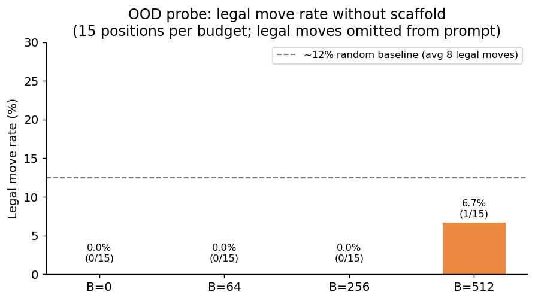
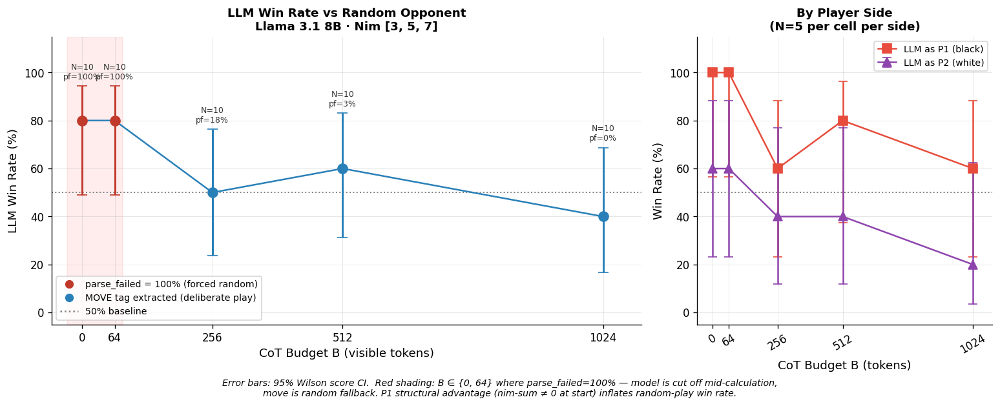
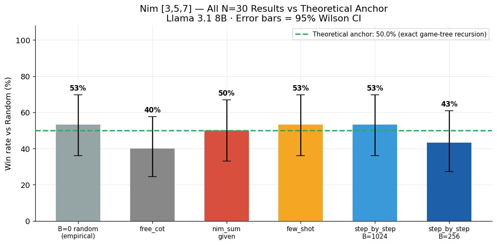
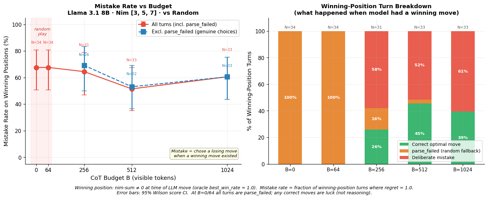
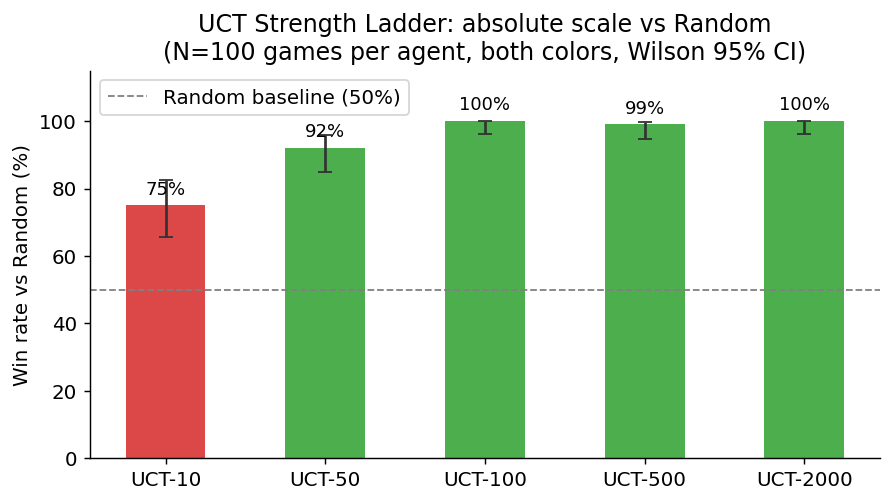

# CoT Budget as a Compute-Grounded Difficulty Knob for LLM Game Agents

**Stephone Christian** — stephone@stanford.edu
CS 348K — Visual Computing Systems, Spring 2026

> **Checkpoint 1 — what to read first.** This README is the checkpoint
> deliverable. It tells you what the project is asking, what experiments we
> are running to answer it, what counts as success, and where the code and
> results live. The full proposal is at [`docs/proposal.md`](docs/proposal.md);
> setup instructions are at [`docs/setup.md`](docs/setup.md).

---

## 1. The one-paragraph version

When you call a chat model, you set `max_tokens` on its reasoning step. We are
asking: **can that single number — call it the CoT budget `B` — act as a
predictable difficulty knob for a game-playing LLM agent?** A predictable knob
means: turn `B` up, the agent plays measurably better; turn `B` down, it plays
measurably worse, with a smooth curve in between. If that holds, then `B` is a
*compute-grounded* control — anyone can dial difficulty without retraining the
model, fine-tuning, or hand-crafting prompts per skill level.

The project measures this on game-playing agents because games give us a clean,
cheap, ground-truth strength signal: win rate against a calibrated opponent
(UCT — i.e., MCTS at a fixed iteration count). We do not propose new methods
in the LLM or in the search; we build the experimental harness, run the
sweeps, and report curves.

> **Status (May 2026).** The originally-planned game (Reversi via the Ludii
> engine) and the originally-planned model (DeepSeek-R1-Distill-7B) both
> turned out to be incompatible with the *visible-CoT-budget* premise — see
> §3 for why. The active workstream is now **Nim → Avalon** on
> **Llama 3.1 8B Instruct** via Ollama. The Reversi/Ludii target stack is
> deferred but still on the roadmap; see [`docs/architecture.md`](docs/architecture.md).

---

## 2. The questions this project is trying to answer

Three questions, in order from most-concrete to most-ambitious:

**Q1. Is `B` a smooth, monotonic difficulty knob on at least one game?**
That is, does turning the reasoning-token budget up actually buy higher win
rate against a fixed opponent, with a continuous-looking curve and
statistically separable steps before saturation? A flat curve, a stepwise
curve, or a non-monotone curve would each be a different finding.

**Q2. When more tokens *do* help, is it because of more reasoning, or just
more output?** A model given more tokens might use them to do more search /
verification / opponent modeling — or it might just produce more verbose
restatements of the same shallow plan. We want to distinguish these two.
Concretely we plan a *filler* control: replace `B` reasoning tokens with `B`
tokens of unrelated arithmetic and see whether win rate moves with token
count or with reasoning content.

**Q3. Does any effect we see on one game generalize to a game with a
fundamentally different reasoning load?** Nim is solved by symbolic
arithmetic (XOR / nim-sum). Avalon is heuristic social deduction, with no
closed-form optimal policy. Reversi sits in between (huge state space,
heuristic evaluation, search-friendly). Whether the budget knob behaves the
same way across these regimes tells us whether we are measuring something
about *games* or something about *symbolic execution under tight budgets*.

A success on all three, or A clean negative
on Q1 — *if anchored properly* against a theoretical or empirical baseline —
is also a worthwhile and reportable result; the Nim pilot already produced
one of these (§5).

---

## 3. Why we pivoted (and what that pivot already taught us)

Before we could run *any* budget sweep, two things had to be true:

1. The model has to put its reasoning into a place where `B` actually controls
   it — i.e., a *visible* output stream that downstream extraction can read.
2. The model has to be able to *participate in the game at all* — produce
   legal moves on its own from whatever state representation we give it.

Both turned out to be load-bearing assumptions, and both broke on the
originally-planned setup. Each break taught us something about how to do this
study correctly:

- **DeepSeek-R1's hidden `thinking` field breaks the knob itself.** When R1
  is served with `think=True`, Ollama splits the output into a hidden
  `thinking` blob and a final `response`. `num_predict=B` controls the
  *thinking* length. If thinking gets truncated, the response is empty and we
  have no move at all. So the actual visible knob is "did the model finish
  thinking before the timer ran out," which is binary and uninterpretable as
  a continuous difficulty knob. Switching to **Llama 3.1 8B with `think=False`**
  puts everything back in a single visible stream and restores `B` as a clean
  knob over visible reasoning. Full write-up: [`docs/nim_experiment_findings.md`](docs/nim_experiment_findings.md) §1.

- **Reversi legality is upstream of the knob.** When asked to pick a Reversi
  move from an ASCII board *without* a list of legal moves in the prompt,
  R1-Distill-7B essentially never produces one (see figure below). It
  pattern-matches `d5` and similar canonical opening squares regardless of
  the actual game state. So on Reversi the bottleneck would have been
  board-parsing, not strategy, and any W(B) curve would be measuring
  "does the model stumble onto a legal coordinate" rather than "how good is
  the chosen move." Until we either find a model that can read the board or
  accept a Pass-2 legal-move scaffold (and reframe the headline accordingly),
  Reversi is on hold. Full write-up: [`docs/ood_probe_findings.md`](docs/ood_probe_findings.md).

  

  *Reversi out-of-distribution probe: with no legal-move list in the prompt,
  R1-Distill-7B picks a legal move on 0/15 positions at B≤256 and 1/15 at
  B=512, well below the ~12% rate you'd expect from random pattern-matching.
  More CoT does not help; the bottleneck is spatial reasoning over an ASCII
  grid, which the model cannot do. This is what forced the pivot off Reversi.*

The combined lesson is the methodological backbone of the project: every game
needs a *positive control* showing the model can play it before any sweep is
interpretable, and every prompt needs to put the budget knob on something
visible. Both checks now run as `scripts/probe_ood.py` (Reversi) and
`scripts/probe_nim_ood.py` (Nim) and are required before any new sweep.

---

## 4. The experiments — what each one is testing for

Each experiment below answers a specific sub-question. For every experiment
we say (a) **why we run it / what we are testing for**, (b) **what we
measure**, (c) **what would count as success vs failure**, and (d) **status**.

---

### Experiment A — Nim pilot, primary sweep `[DONE]`

**Why we run it.** Nim is solved by exact symbolic arithmetic (XOR). That
makes it the cleanest possible test bed for Q1: we know the *exact*
random-vs-random win rate from game-tree recursion (50.0%), so any "the
model is reasoning" claim must beat that anchor by more than sampling noise.
If `B` is a real difficulty knob, even on a small (8B) model, we should see
a non-flat W(B) curve here.

**What we measure.** LLM win rate against a uniform-random opponent across
B ∈ {0, 64, 256, 512, 1024} on Nim [3,5,7], counterbalanced (LLM plays P1 in
half the games and P2 in half), N=10 per cell. 95% Wilson CIs reported.
Llama 3.1 8B Instruct via Ollama, `think=False`, T=0.

**Success vs failure.**
- *Success:* W(B) is monotonically increasing with at least one budget cell
  significantly above the 50% theoretical anchor (binomial p<0.05).
- *Failure (still informative):* W(B) flat at chance — but only if the 50%
  anchor is plotted alongside, otherwise you can't tell flat-at-chance from
  a noisy upward trend.

**Status: DONE; result is "flat at chance."** No budget cell beats the 50%
anchor. The B=0/B=64 bars look high (80%) only because parse-failed
fallbacks at those cells are filling in random moves, and the per-config
random anchor is itself 50%. This is an honest negative because the anchor
makes the claim falsifiable.



*W(B) for Llama 3.1 8B on Nim [3,5,7] vs random opponent, N=10/cell.
The shaded red region is where parse-failed=100% (model is cut off
mid-calculation; moves come from the random fallback — those bars are
**not** "low-budget reasoning"). The right panel splits by side and shows
the structural P1 advantage: P1 plays from a winning nim-sum and the
LLM-as-P1 wins a lot even at B=0 (random fallback) because the position
itself is winnable; LLM-as-P2 is in a losing position from move 1.*

---

### Experiment B — Effective-budget threshold (Nim) `[DONE — co-result of A]`

**Why we run it.** Before interpreting W(B), we need to know whether the
model actually finishes its move at each `B`. If the response is truncated
before the model writes its final `MOVE: pile=X take=N` tag, the harness
falls back to a random legal move — and that "loss" is *not* about
reasoning, it's about token budget. We need to know the smallest `B` at
which truncation stops dominating, so the cells below that threshold get
explicitly flagged in headline plots.

**What we measure.** `parse_failed` rate per budget — fraction of LLM
turns where no valid move was extracted from the response. Reported per cell
on the same Nim runs as Experiment A.

**Success vs failure.** This is a measurement, not a hypothesis test —
the question is "where is the threshold." It is a *failure of the
experimental setup* if the threshold lands above the budgets we tested;
otherwise we just report it.

**Status: threshold lives at ~250–350 tokens for Llama 8B on Nim.** Below
that, the MOVE tag does not fit after the binary-arithmetic trace, so
`parse_failed → 100%` and B=64 is functionally identical to B=0. This is
why the W(B) headline figure shades the B∈{0,64} cells red — they should
not be read as "low-budget reasoning."

---

### Experiment C — Diagnostic prompt sweep at N=30 `[DONE]`

**Why we run it.** Experiment A could be flat for two very different
reasons: (i) the model genuinely cannot reason about Nim regardless of how
we ask, or (ii) our particular prompt is bad and a better one would unlock
the budget effect. We ran four prompt structures at the highest budget to
disambiguate. Triple-N from 10 to 30 to tighten CIs from ±31pp to ±18pp.

**What we measure.** Win rate vs random at B=1024 on Nim [3,5,7] for four
prompt variants:
- `free_cot` — unstructured "Think through your move."
- `nim_sum_given` — we hand the model the XOR value as a starting point.
- `step_by_step` — explicit five-step procedural scaffold.
- `few_shot` — one fully-worked example before the model's turn.

Plus a budget contrast inside the strongest variant (`step_by_step` at
B=256 vs B=1024).

**Success vs failure.**
- *Success* (any flavor): one variant beats the 50% anchor at p<0.05, or
  `step_by_step` shows a real B=256→B=1024 lift.
- *Failure-locked-in*: all variants land within ±10pp of 50%, the
  variants are statistically indistinguishable from each other, and the
  budget gradient is inconclusive at N=30 (would need ≈85 to resolve).

**Status: failure locked in at N=30.** No variant is significantly above
the 50% anchor. The N=10 result that suggested `step_by_step` was 70%
shrank to 53% at N=30 and lost statistical significance. The gap between
structured and unstructured variants (~13pp) is directional but underpowered.



*All N=30 prompt-variant cells on Nim [3,5,7] at B=1024 vs random,
plotted against the exact 50% theoretical anchor. Every Wilson CI
crosses the anchor line. The model neither beats chance nor responds
to any of the four prompt structures we tried.*

---

### Experiment D — Failure-mode taxonomy `[DONE — qualitative]`

**Why we run it.** A flat win-rate curve does not tell us *how* the model
is failing. Two completely different bugs can produce the same 50% — and
they imply completely different fixes. The point of this experiment is to
make the failure mode legible enough to act on, not to add another
quantitative cell.

**What we measure.** Hand-inspect 10 raw reasoning traces (5 `free_cot`,
5 `step_by_step`, all from games where the LLM had a winning move and
chose a losing one). Cluster the failure modes.

**Success vs failure.** A useful taxonomy is one where each cluster
maps to a *specific*, *targeted* prompt fix.

**Status: three to four distinct failure clusters identified per regime.**
`free_cot` failures are dominated by XOR arithmetic mistakes
(e.g., `3⊕5⊕7=15` — decimal addition, not XOR), strategic goal reversal,
and hallucinated Nim concepts. `step_by_step` failures are different in
*kind* — column-alignment errors in binary representation, verification-loop
confusion (interpreting nim-sum=0 *after* one's own move as a personal
loss), and disagreement between the prose conclusion and the final MOVE
tag. Each cluster has a known, narrow fix; that work is queued for the
larger-Nim or Avalon phase. Detail in [`docs/nim_experiment_findings.md`](docs/nim_experiment_findings.md) §9.



*Left: mistake rate on winning-position turns (the per-turn analogue of the
game-level metric). Right: what happened in those winning positions —
green is "model picked the optimal move," red is "model deliberately picked a
losing move," orange is parse-failed → random fallback. Even at B=1024 the
model picks correctly only 39% of the time when given a winnable position;
above the parse-failed threshold this is no better than chance. This is
the per-turn evidence behind the flat W(B) headline.*

---

### Experiment E — Avalon Merlin budget sweep `[NEXT]`

**Why we run it.** Nim told us that on a *symbolic* game, `B` does not buy
above-chance play because the bottleneck is unreliable arithmetic
execution. But the original conjecture was about *strategic* reasoning, not
arithmetic — Avalon is the right venue because (a) there is no closed-form
optimal policy, (b) play is heuristic deduction over noisy signals, and
(c) AvalonBench publishes naive-bot baselines, so we have a non-trivial
empirical anchor to plot against. If `B` is a real knob for *any* game it
should show up here. Full plan: [`docs/avalon_test_plan.md`](docs/avalon_test_plan.md).

**What we measure.** LLM-as-Merlin (good side; hardest information set)
vs four AvalonBench rule-based naive bots, B ∈ {64, 256, 1024}, N=30
per cell. Same model and decoding as Nim. Single LLM at the table; no
multi-LLM confounds.

**Success vs failure.**
- *Success:* `W(1024)` ≥ naive-bot anchor + ~15pp with non-overlapping
  CIs, and the curve is monotone-ish (B=64 ≤ B=256 ≤ B=1024 within sampling
  noise).
- *Negative-but-clean:* all cells within ±10pp of the naive-bot anchor.
  This locks in "Llama 8B does not exceed naive-bot heuristic play on
  Avalon-Merlin even at B=1024" — combined with Nim's symbolic-execution
  result, that is a publishable joint negative.

**Status: integration spike (~1–2 days of work) is the next concrete task.**
It builds an `avalon.py` adapter under `src/cot_knob/games/`, vendors
AvalonBench under `third_party/`, and runs one full game end-to-end with
the existing `LLMClient` before any sweep starts.

---

### Experiment F — Confound isolation (filler / memory / decoding) `[GATED on E]`

**Why we run it.** This is the answer to Q2. A budget-vs-win-rate curve
on its own can't tell us whether the lift comes from *reasoning content*
or from a length-correlated confound (sampling diversity, recency bias,
move commitment, etc.). The gating logic: this experiment only matters
if Avalon shows a non-flat curve. If Avalon is also flat, there is no
effect to attribute.

**What we measure (planned).**
- *Filler control:* replace `B` reasoning tokens with `B` tokens of
  pre-generated arithmetic problem-and-answer text (game-independent,
  length-matched at the token level). N=30. If filler win rate matches
  B=0 rather than full CoT, reasoning content is established as the
  mechanism.
- *Memory ablation:* full chronological history vs structured summary at
  fixed `B`. Tests whether memory representation is a hidden confound
  with budget.
- *Decoding ablation:* T=0.7 at B ∈ {64, 1024}, N=30. Tests whether the
  curve shape survives non-greedy sampling.

**Success vs failure.** Filler ≈ B=0 means reasoning content is the
mechanism. Filler ≈ full CoT means we are measuring length, not
reasoning, and the headline framing has to change.

**Status: not started; gated on Experiment E showing a non-flat curve.**

---

### Experiment G — Nim high-N follow-up `[OPTIONAL]`

**Why we run it.** Two N=30 effects from Experiment C are directional but
underpowered: `step_by_step` − `free_cot` ≈ 13pp, and `step_by_step` B=256
vs B=1024 ≈ 10pp. Tripling N to 85 either resolves these at p<0.05 or
locks in the negative. This is *only* worth doing if we want a
publication-strength claim about Nim specifically; otherwise the Nim
chapter ends at "flat at chance, here are the failure modes." Full plan:
[`docs/nim_test_backlog.md`](docs/nim_test_backlog.md) §3.

**Status: planned, deferred until Avalon E1 is in flight.**

---

### Experiment H — Reversi/Ludii target stack `[DEFERRED]`

**Why we run it.** Reversi was the proposal's primary game and remains
the natural endpoint: it has a well-calibrated UCT opponent ladder
(see figure), substantial state-space, and prior literature
([`docs/architecture.md`](docs/architecture.md)) sets honest expectations
that LLMs at this scale don't dominate UCT-2000. Three concrete things
have to land before a Reversi sweep is interpretable: (1) a model that
can produce a legal Reversi move from raw board state (the OOD-probe
gate); (2) the Ludii Java bridge under JPype — see Risk 1 in the
proposal; (3) the SGLang serving stack on Blackwell. None of these is
blocked technically, but each costs days.

**Status: harness scaffolded, runs end-to-end on a deterministic mock
backend; LLM serving and Ludii bridge are deferred behind Avalon.**



*Reversi UCT strength ladder, N=100 games per cell, both colors,
Wilson 95% CI. UCT-10 is roughly random play (75% vs uniform random);
UCT-50 already wins 92%; UCT-100 and above saturate at near-100% vs
random. This is the calibrated opponent ladder against which any LLM
Reversi result has to be plotted — a single anchor would be misleading.*

---

## 5. What "success for the project as a whole" looks like

Pulling §4 together, the project succeeds if **at least one of** the
following is true at the end of the term, plus the methodological
hygiene for *all* of them:

1. **Positive headline.** `W(B)` is monotonically increasing on Nim,
   Avalon, or Reversi with at least one statistically distinguishable
   step before saturation, *and* the filler control matches B=0 rather
   than full CoT (so the lift is reasoning, not length).
2. **Anchored negative headline.** `W(B)` is flat against a *theoretical
   or large-N empirical* baseline on at least two games (e.g. Nim+Avalon),
   with documented failure modes, parse-failed thresholds, and a clear
   description of what would have to change for the knob to start working.
3. **Adaptive controller demo.** Even if W(B) is curve-shaped only in a
   narrow regime, a sliding-window controller using `B` to track a 50%
   target win rate against UCT-500 / UCT-2000 converges within ±10pp;
   this is a concrete usability demo of the knob even when the underlying
   curve is shallow. (Proposal Task 10.)

Methodological hygiene that must hold for *every* result we report,
positive or negative:

- A theoretical or empirical *anchor* is plotted on every win-rate
  figure. We learned from Nim that "above 50%" is meaningless without
  knowing whether 50% is the right baseline for that configuration.
- Parse-failed cells are explicitly flagged so they are not read as
  "low-budget reasoning." The shaded red region in the headline Nim
  figure is the template.
- Per-game OOD probe must pass before any sweep is run; results stay
  interpretable only as "strategic discrimination given a pre-validated
  legal set" if the legality probe was the load-bearing step.
- Sample sizes hit at least N=30/cell for any cell that appears in a
  headline figure; underpowered effects are reported as "directional"
  with the N needed for resolution.

---

## 6. Evaluation code that already runs today

here is what is wired up and
exercised right now. Each item is one shell command and points at code
or a results document you can read.

**Unit & integration tests — `uv run pytest -q`.** 26 tests, ~45 seconds,
no GPU. Covers config schemas, the SQLite Store, the JSONL writer, the
mock LLM, the runner skeleton, the Reversi serializer, the UCT agent,
the LLM agent's two-pass control flow, and the memory manager. Sources
in [`tests/`](tests/).

**Trivial-baseline end-to-end sweep — `uv run python scripts/run_budget_sweep.py configs/smoke_n3_mock.yaml`.**
This runs the full pipeline (config → sweep → SQLite → JSONL → plots)
with a *deterministic mock LLM*. The mock always loses to UCT, so the
expected curve is 0% win rate at every `B`. This is a result we can definitively say is "not
successful play," produced by a pipeline that already runs end-to-end.
The canonical reference run is logged in
[`docs/run_log.md`](docs/run_log.md) as `run_3b5e0e753407`
(2026-04-30, 12/12 games completed, 0% win rate at every `B`,
Pass-1 token counts tracking `B` correctly: 0 / 64.0 / 247.7 / 1001.5
mean).

**Per-run analysis — `uv run python scripts/analyze_run.py <run_id>`.**
Produces the win-rate-vs-budget plot, latency-by-budget, token-count
sanity, and UCT top-3 agreement, plus a printed Rich table summary.
Code: [`scripts/analyze_run.py`](scripts/analyze_run.py),
[`src/cot_knob/analysis/plots.py`](src/cot_knob/analysis/plots.py),
[`src/cot_knob/tracking/analytics.py`](src/cot_knob/tracking/analytics.py).
Every Nim figure in §4 was generated by this pipeline against real
sweep data.

**Budget-enforcement audit — `uv run python scripts/check_budget_enforcement.py <run_id>`.**
Walks every Pass-1 model call and flags any case where
`n_output_tokens > B + slack`. Catches backend regressions where
`num_predict` is being ignored.

**Out-of-distribution probes — [`scripts/probe_ood.py`](scripts/probe_ood.py)
and [`scripts/probe_nim_ood.py`](scripts/probe_nim_ood.py).** The
"can the model even play this game" gate that runs before any sweep on
a new game/model. Their outputs are the basis of §3 and the Reversi
figure above.

**Notebooks — actual analyses already produced.** All under
[`notebooks/`](notebooks/):

- `01_uct_strength_ladder.ipynb` — Reversi UCT calibration (source
  of the UCT-strength figure in Experiment H).
- `02_prelim_sweep_analysis.ipynb` — early Reversi sweep at N=2, kept
  as a reference for the move-quality / phase analyses we'll re-run on
  Avalon.
- `03_ood_probe.ipynb` — Reversi OOD probe (source of the legality
  figure in §3).
- `04_nim_ood_probe.ipynb` — Nim OOD probe.
- `05_nim_prelim_sweep.ipynb` — first Nim Llama sweep.
- `06_nim_llama_sweep.ipynb` — full Nim sweep analysis (source of the
  W(B) figure in Experiment A and the per-turn breakdown in
  Experiment D). Rendered version:
  [`notebooks/06_nim_llama_sweep.pdf`](notebooks/06_nim_llama_sweep.pdf).
- `07_nim_diagnostics.ipynb` — N=30 prompt-variant lock-in (source of
  the diagnostics-anchor figure in Experiment C).

In short: the harness, the analysis pipeline, and the figure-production
path are already running and have produced the result figures embedded
in this README. What is *not* yet wired up is the Avalon adapter
(Experiment E spike) and the filler / memory / decoding controls
(Experiment F).

---

## 7. Repository layout

```
src/cot_knob/
├── llm/         # LLMClient ABC + MockClient + OllamaClient + SGLangClient (stub)
├── games/       # Reversi state, Nim state, GameState protocol
├── agents/      # LLMAgent (two-pass), UCTAgent, NimOptimal
├── memory/      # FullHistoryMemory, StructuredSummaryMemory, LastMoveMemory
├── prompts/     # Reversi & Nim prompt templates (free + structured CoT)
├── experiments/ # config (pydantic), runner (single match), sweep (config-driven)
├── tracking/    # SQLite Store, JSONLWriter, analytics queries
└── analysis/    # plotting helpers
```

The **Mac↔PC seam** is exactly `src/cot_knob/llm/`. Everything else is
platform-agnostic. On the RTX 5080 / 5090 box we replace `OllamaClient`
with `SGLangClient` (or `VLLMClient` as a fallback for sm_120 INT4
issues — see [`docs/architecture.md`](docs/architecture.md)) and re-run
the same configs. PC bring-up checklist:
[`docs/pc_dev_setup.md`](docs/pc_dev_setup.md).

## 8. Where results live

- `data/results.db` — normalized SQLite source of truth (runs, trials,
  turns, model_calls, summaries, controller_decisions). Schema reference:
  [`docs/tracking_schema.md`](docs/tracking_schema.md).
- `data/runs/<run_id>/*.jsonl` — append-only per-trial event log
  (raw backup; survives DB corruption).
- `data/runs/<run_id>/figures/*.png` — analysis plots from
  `analyze_run.py`.
- `docs/figures/` — frozen, README-embedded versions of the headline
  figures.

## 9. Documents

| Document | What's in it |
|---|---|
| [`docs/proposal.md`](docs/proposal.md) | The original proposal — the full 14-task plan, the formal definition of success, references. |
| [`docs/architecture.md`](docs/architecture.md) | Live design doc — current vs target stack, Mac/PC split, oracle metrics, sm_120 caveats. |
| [`docs/nim_experiment_findings.md`](docs/nim_experiment_findings.md) | Everything we learned from the Nim pilot — pivot rationale, OOD probe, sweep results, diagnostics, failure-mode taxonomy. |
| [`docs/nim_test_backlog.md`](docs/nim_test_backlog.md) | The high-N Nim follow-up plan if we ever come back for the publication-strength Nim chapter. |
| [`docs/avalon_test_plan.md`](docs/avalon_test_plan.md) | Full plan for Experiment E (E1 Merlin sweep, E2 prompt robustness, E3 memory, E4 role coverage). |
| [`docs/ood_probe_findings.md`](docs/ood_probe_findings.md) | Reversi OOD probe — why R1-Distill-7B can't read an ASCII board. |
| [`docs/run_log.md`](docs/run_log.md) | One paragraph per experimental run; mirrors `runs.run_id` in SQLite. |
| [`docs/tracking_schema.md`](docs/tracking_schema.md) | SQLite schema reference. |
| [`docs/setup.md`](docs/setup.md) | Mac dev quick start. |
| [`docs/pc_dev_setup.md`](docs/pc_dev_setup.md) | Linux / RTX-5080 production setup. |

---

## 10. Setup

See [`docs/setup.md`](docs/setup.md) for Mac dev setup and
[`docs/pc_dev_setup.md`](docs/pc_dev_setup.md) for the production box.
