# CoT Budget as a Compute-Grounded Difficulty Knob for LLM Game Agents

**Stephone Christian** — stephone@stanford.edu  
CS 348K — Visual Computing Systems, Spring 2026

The full project proposal lives at [`docs/proposal.md`](docs/proposal.md).  
Architecture and build notes are at [`docs/architecture.md`](docs/architecture.md).  
Detailed Nim findings (all tables, traces, mechanism analysis) are at [`docs/nim_experiment_findings.md`](docs/nim_experiment_findings.md).

---

## What this project does

The project asks a simple question: if you give a language model more tokens to think before it acts in a game, does it play better? We call the token limit `B` — the **CoT budget** — and treat it as a dial that controls reasoning depth. The game is the oracle: win rate vs `B` gives a clean, automatic measure of whether more thinking helps.

We run experiments across two games using **Llama 3.1 8B Instruct** served via SGLang:

**Nim [3,5,7]** is the pilot. Nim is a solved combinatorial game with a known closed-form optimal strategy (nim-sum). It lets us measure performance against both a random baseline (50% exact) and a perfect opponent (0% unless the model plays optimally). The budget curve is flat across all variants. Tracing the losses reveals why: the model correctly identifies the nim-sum algorithm at every turn but consistently miscalculates `a XOR b XOR c` for mid-game pile sizes. More reasoning tokens produce more text re-deriving the same wrong answer. **The budget knob does not work when the bottleneck is arithmetic, not reasoning.**

**Avalon** is the pivot. Avalon is a social deduction game with no closed-form optimal policy, where the core skill is belief tracking and deduction from hidden information, and deception!. Here we have data to suggest the knob works, pending intermediate budget runs and further analysis. Proposal regret (the fraction of leadership turns the model wastes on a team containing an Evil player) drops from **54% at B=64** to **7.5% at B=1024 with a procedural prompt**.Merlin, the character who already knows the Evil players' identities, achieves near-zero regret (5.3%) immediately. **These findings suggest that the budget knob modulates reasoning quality when the task is inference, not computation.**

The two games together form a controlled contrast: same model, same infrastructure, but different sensitivities to CoT budget allocation.

---

## Quick start

### 0. Set up the environment

```bash
# Clone and install Python deps
git clone <repo>
cd CoT-difficulty-knob
uv sync
```

### 1. Start the SGLang server (PC with GPU)

Requires an NVIDIA GPU with ≥16 GB VRAM. FP8 quantization is needed to fit Llama 3.1 8B.

```bash
CUDA_HOME=/usr/local/cuda-13.2 uv run python -m sglang.launch_server \
    --model-path meta-llama/Llama-3.1-8B-Instruct \
    --port 30000 --host 127.0.0.1 --quantization fp8
```

Wait for `"Server is ready"` before running experiments. See [`docs/pc_dev_setup.md`](docs/pc_dev_setup.md) for full setup instructions.

### 2. Validate the harness with the mock backend

```bash
uv run pytest -q                                         # unit tests (~45s)
uv run python scripts/run_budget_sweep.py configs/smoke_n3_mock.yaml
uv run python scripts/analyze_run.py <run_id>
```

This runs the full pipeline (config → sweep → SQLite → JSONL → plots) without any LLM server. The mock agent loses to UCT every game — that is expected.

### 3. Run a Nim sweep

```bash
uv run python scripts/run_budget_sweep.py configs/nim_vs_random_n30_sglang.yaml
uv run python scripts/analyze_run.py <run_id>
```

Each config file specifies the game, budgets, number of seeds per cell, opponent, and prompt variant. See `configs/` for all run configurations used in the paper.

### 4. Open the analysis notebooks

```bash
cd notebooks
uv run jupyter lab
```

- `06_nim_llama_sweep.ipynb` — main budget sweep: win rate vs `B`, token output vs budget, mistake rate on winning positions
- `07_nim_diagnostics.ipynb` — variant comparison, P1/P2 split, phase-stratified analysis, win trace classification, pooled binomial test, vs-optimal trace inspection

---

## Avalon results

Our Nim findings show that Llama 3.1 8B can identify the correct strategy for a combinatorial game but cannot execute the arithmetic it requires. XOR computation is the issue, not reasoning about strategy. This is what motivates the pivot to Avalon. Avalon is a social deduction game where there is no closed-form optimal policy. The strategy requires belief tracking, deception, social heuristics, and inferring hidden information across multiple players.


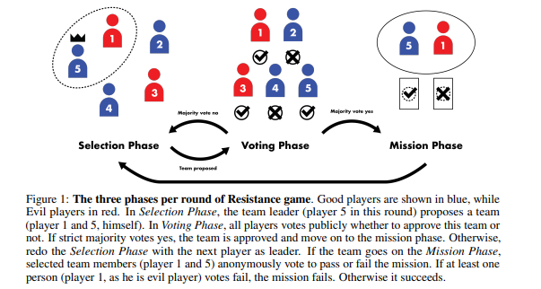

*Figure from Light et al., "Avalonbench: Evaluating LLMs Playing the Game of Avalon," NeurIPS 2023 Workshop on Games and Decisions in AI.*

### Game setup

Avalon is a hidden-role game played in groups of 5–7. In the 5-player variant there are 3 **Good** players (Merlin and 2 Servants) and 2 **Evil** players (Minion and Assassin). The game proceeds across a series of "quests": a rotating leader proposes a team, all 5 players vote to approve or reject it, and the approved team secretly votes on whether the quest succeeds or fails. Evil players can sabotage quests. Good wins if 3 quests succeed and Merlin is not assassinated at the end. Evil wins if 3 quests fail or if they correctly identify and assassinate Merlin.

Each role has different levels of information:
- **Merlin** knows who the Evil players are (and by definition who the Good players are), but must stay hidden or be assassinated.
- **Servants** know only their own identity and must deduce evil and good from voting and quest patterns.
- **Evil players** know each other's identities and can coordinate sabotage. hehe.

### Harness setup

The Avalon game engine is adapted from [AvalonBench](https://github.com/jonathanmli/Avalon-LLM). The LLM always plays as Player 0 against four **naive bots** (matching the AvalonBench baseline from Light et al., NeurIPS 2023). Leadership rotates clockwise among all 5 players; the starting leader is chosen uniformly at random.

| Role | When leader: proposes… | Team vote | Quest vote |
|------|------------------------|-----------|------------|
| Bot Merlin | A uniformly random all-Good team | Rejects if any Evil on team; approves otherwise | Always passes |
| Bot Servant | A uniformly random team (any players) | Always approves | Always passes |
| Bot Evil (Minion / Assassin) | A team with ≥1 Evil player | Approves if any Evil on team; **rejects** if team is all-Good | Always fails |
| Bot Assassin | — | (same as Evil above) | Always fails; guesses Merlin randomly at game end |

This creates a key structural constraint on the vote outcome:

- **Dirty proposals** (any Evil on team): Bot Servant + Bot Evil1 + Bot Evil2 = **3 approvals** → always passes regardless of LLM or Merlin vote.
- **Clean proposals** (all Good): Bot Merlin + Bot Servant = **2 approvals** → passes only if the **LLM also approves** (the LLM is the deciding vote for its own clean proposals).

Because of this, win rate is dominated by which quest turns the LLM happens to lead — a structural lottery. We believe a more meaningful signal is **proposal regret = 1 − P(LLM proposes a clean team | LLM is leader)**. A Bayesian-optimal Servant would converge to 0% regret as quest outcomes reveal evil identities. We use proposal regret as the primary metric throughout.

### What makes a Good player effective?

Two distinct skills determine success in this setup:

**1. Team composition quality.** When the LLM is the rotating leader, does it propose a clean (only Good players) team? This is the main way the LLM can try to win the game and produce clean quests. We measure this as:
- **Uncond. quality** = P(proposed team is all-Good | LLM is leader)
- **Proposal regret** = 1 − uncond. quality (0% is ideal; a Bayesian-optimal agent achieves 0% in the limit)

A random proposal drawn uniformly from all 5 players produces a clean team with probability C(3, k) / C(5, k): **30%** for 2-person quests and **10%** for 3-person quests. Weighted by the 5-player quest structure (two 2-person quests, three 3-person quests at roughly equal LLM leadership probability), the unconditional random baseline is approximately **18–20%**.

**2. Approval coherence.** Does the LLM vote consistently with its proposals? Clean proposals pass only if the LLM approves them. A model that proposes a clean team but then votes it down wastes its leadership turn. We track this with:
- **Cond. quality** = P(approved team is all-Good | proposal was approved). This measures the quality of teams that actually go on quests
- **Acceptance rate** = P(LLM's proposal was approved)

The gap between cond. quality and uncond. quality reveals incoherence: if the LLM systematically rejects its own clean proposals, cond. quality collapses relative to uncond. quality. This becomes the central diagnostic for budget effects.

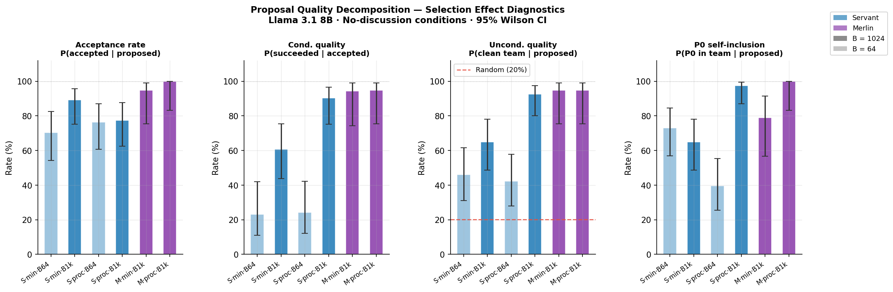

Under ideal play: uncond. quality → 100%, cond. quality → 100%, acceptance → 100%, and the uncond./cond. gap → 0. Under random play: uncond. quality ≈ 18–20% (the C(3,k)/C(5,k) baseline). A large uncond./cond. gap at low budget is the signature of the incoherence finding explored in Experiment A2.

---

### Experiment A1 — Budget effect on Servant (B=64 vs B=1024, minimal prompt)

**Why we ran this.** The first question is whether the budget knob moves anything at all in Avalon. Nim showed a flat budget curve, however we expected Avalon to respond to budget because the core skill (tracking which players might be evil across quest history) is a reasoning task without a fixed-length arithmetic bottleneck. We ran N=100 games per budget at B=64 and B=1024 with the LLM as a Servant.

**What we learned.** Win rate is near-zero at both budgets (0.0% at B=64, 3.0% at B=1024), but proposal regret tells a clearer story. At B=64, the LLM proposes a clean team only 45.9% of the time. Against the random baseline of ~18–20% (C(3,k)/C(5,k) weighted by quest size: 30% for k=2, 10% for k=3), this is roughly 2.5× better than chance ( the model is doing something!)  but still not exhibiting ideal behavior. At B=1024, proposal quality rises to 64.9%, a meaningful 19 pp improvement in reasoning quality that win rate alone would miss.

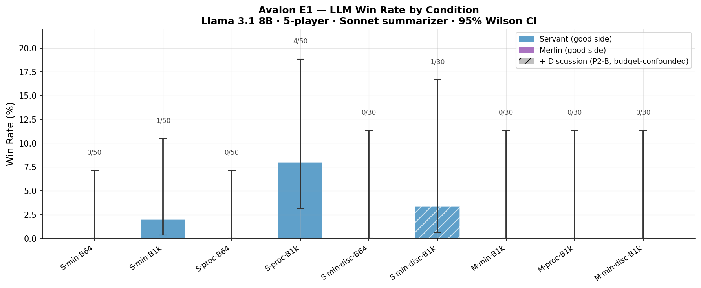

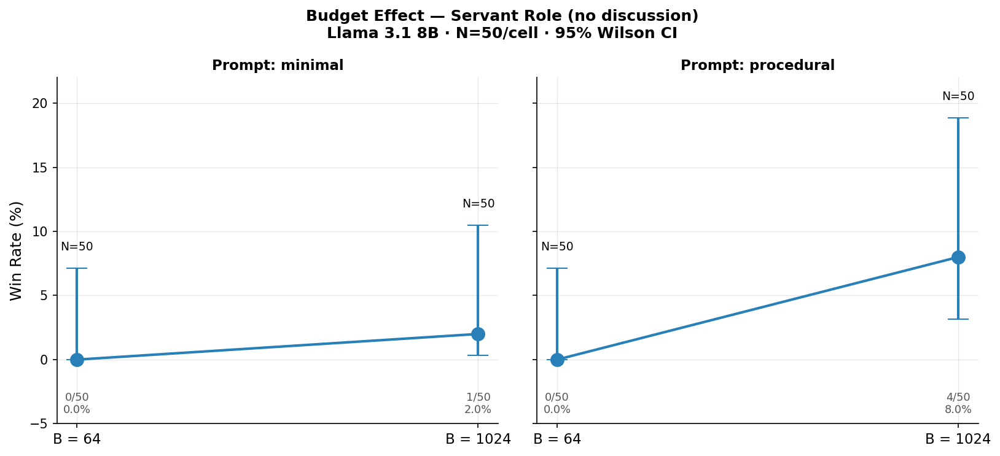

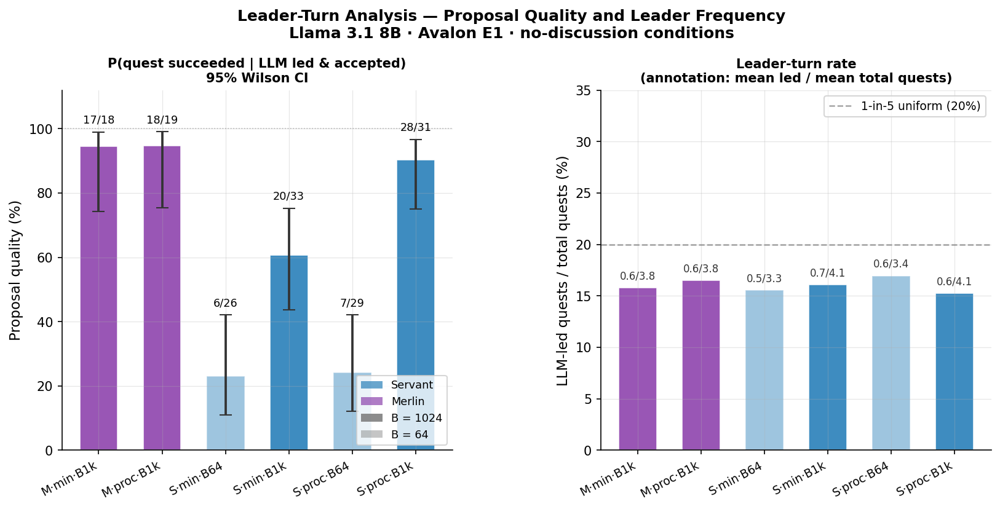

| Condition | Win rate | 95% CI | Uncond. quality | Proposal regret |
|-----------|----------|--------|-----------------|-----------------|
| S·min·B64  | 0/100 = 0.0% | [0.0%, 3.7%]  | 45.9% | **54.1%** |
| S·min·B1k  | 3/100 = 3.0% | [1.0%, 8.5%]  | 64.9% | **35.1%** |

---

### Experiment A2 — B=64 budget incoherence

**Why we ran this.** At B=64, conditional proposal quality (quality given the proposal was accepted) is 23.1%. This is HALF of unconditional quality (45.9%). In a naive voting game this makes no sense: if 45.9% of proposals are clean, accepted proposals should contain at least that fraction of clean teams. The gap suggests the LLM at B=64 is voting *against* its own proposals.

**What we learned.** At B=64, the LLM approves only 19% of its own proposals (35% for clean proposals, 5% for dirty ones). At B=1024, self-approval rises to 84%. The proposal and vote calls are separate truncated-budget calls; at B=64 the model doesn't generate enough tokens to maintain consistent intent across them. Clean proposals need LLM approval to pass (LLM + BotMerlin + BotServant = 3 required approvals), so the LLM systematically rejects the clean teams it just proposed.

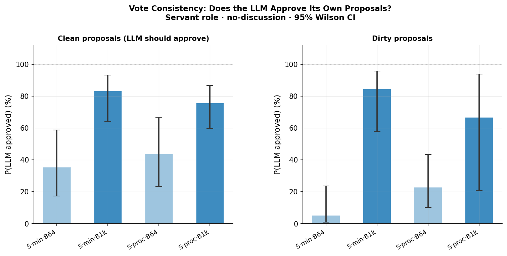

| Budget | P(LLM approves own proposal) | P(approves clean) | P(approves dirty) |
|--------|------------------------------|-------------------|-------------------|
| B=64   | 19%                          | 35%               | 5%                |
| B=1024 | 84%                          | 83%               | 85%               |

---

### Experiment A3 — Prompt variant (minimal vs procedural at B=1024)

**Why we ran this.** Given that budget alone raises proposal quality from 46% to 65%, the next question is whether a better prompt can push it further. The minimal prompt gives the LLM its role and quest history and asks it to reason freely. The procedural prompt adds explicit step-by-step guidance: list each player's quest-vote history, reason about who has failed quests, eliminate suspects, then choose a team. We ran N=100 per condition at both B=64 and B=1024.

**What we learned.** At B=64, procedural and minimal produce equivalent low proposal quality (42.1% vs 45.9%  almost the same and surely CIs overlapping at this sample size). At B=1024, the procedural prompt unlocks near-zero regret: 92.5% of proposals are clean teams, compared to 64.9% for minimal. The procedural scaffold tells the model exactly which reasoning steps to perform. At B=1024 the model has enough tokens to follow all of them. At B=64, the context is truncated before the scaffold pays off. This suggests that there is a floor of required CoT reasoning tokens for baseline quality, something I plan to look into for next steps.

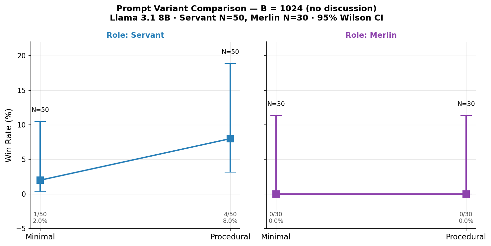

| Condition   | Win rate | Uncond. quality | Proposal regret |
|-------------|----------|-----------------|-----------------|
| S·min·B64   | 0.0% [0.0%, 3.7%]   | 45.9% | 54.1% |
| S·min·B1k   | 3.0% [1.0%, 8.5%]   | 64.9% | 35.1% |
| S·proc·B64  | 0.0% [0.0%, 3.7%]   | 42.1% | 57.9% |
| S·proc·B1k  | 8.5% [3.7%, 18.4%] | 92.5% | 7.5%|

---

### Experiment A4 — Role comparison (Merlin vs Servant, B=1024)

**Why we ran this.** The Servant must figure out evil identities from quest outcomes. This is an inference problem that gets easier as quests accumulate and more game history is present in the model context. Merlin already knows who is evil at game start. If the model uses its role information, Merlin should achieve near-zero regret immediately, while Servant should converge more slowly. We ran N=30 games per condition at B=1024 for both roles and both prompt variants.

**What we learned.** Merlin achieves 94.7% proposal quality (5.3% regret) under both minimal and procedural prompts. This is statistically indistinguishable from procedural Servant at B=1024 (92.5%). Win rate is 0/30 for both Merlin conditions, consistent with the naive-bot structural ceiling. The LLM uses Merlin's privileged information effectively in proposals, howevevr the game still ends in Evil wins because the naive vote-blocking structure prevents the LLM from controlling quest outcomes. In future we will look into a better game setup to overcome this vote-blocking structure to also infer more meaning from the win rate.

| Condition   | Win rate              | Proposals | Uncond. quality | Regret |
|-------------|-----------------------|-----------|-----------------|--------|
| M·min·B1k   | 0/30 = 0.0% [0.0%, 11.4%] | 19 | 94.7% | **5.3%** |
| M·proc·B1k  | 0/30 = 0.0% [0.0%, 11.4%] | 19 | 94.7% | **5.3%** |
| S·proc·B1k  | 5/59 = 8.5% [3.7%, 18.4%]| 40 | 92.5% |  7.5% |

---

### Experiment A5 — Discussion phase ablation

**Why we ran this.** The standard Avalon protocol includes a discussion phase before each team vote, where players argue for or against proposals. We enable the model to discuss to give the LLM a chance to exchange information with bots and to read (or be misled by) their statements. We tested whether adding discussion changes outcomes for Servant at B=64 and B=1024, and for Merlin at B=1024. This also serves as a place to collect qualitative data, which we will in future parse through. Some interesting questions are: is the model able to hide its identity? Is the discussion meaningful and strategy aligned? What are the failure modes, if we where to characterize them?

**What we learned.** Discussion makes no measurable difference. Win rates remain near zero across all conditions with discussion enabled. The vote-blocking structure of the naive bots dominates: bot approvals are unconditional regardless of what is said in the discussion phase, so there is no informational channel from discussion to vote outcomes. The LLM's discussion outputs are neither heeded by bots nor able to change the structural approval dynamics.

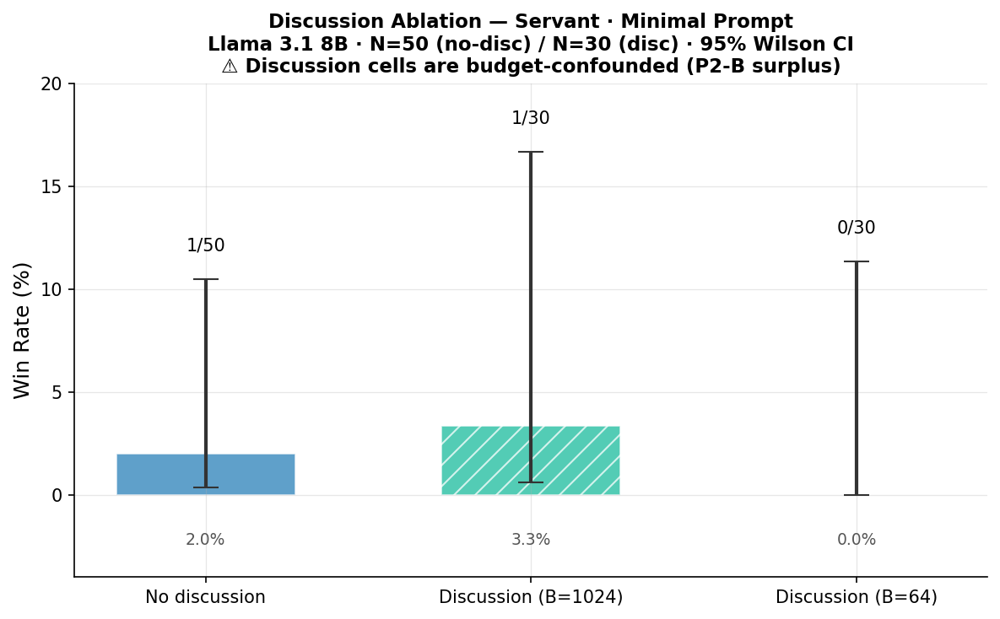

| Condition              | Win rate               |
|------------------------|------------------------|
| S·min·B1k (no disc)    | 3/100 = 3.0% [1.0%, 8.5%] |
| S·min·B1k + discussion | 1/30 = 3.3% [0.6%, 16.7%] |
| S·min·B64 + discussion | 0/30 = 0.0% [0.0%, 11.4%] |
| M·min·B1k + discussion | 0/30 = 0.0% [0.0%, 11.4%] |

---

### Experiment A6 — Summarizer ablation (Llama 8B vs Sonnet)

**Why we ran this.** The harness calls a summarizer model after each quest to compress the game history into a structured paragraph that fits within the LLM's context. The default summarizer is Claude Sonnet (claude-sonnet-4-6). To isolate whether the summarizer quality drives proposal quality, we re-ran the S·min·B1k condition with Llama 3.1 8B Instruct as the summarizer. This is the same model playing the game.

**What we learned.** All four proposal-quality metrics are statistically indistinguishable between the Sonnet and Llama-8B summarizer conditions at N=30. The facts-only template constrains the summarizer to emit structured quest outcomes and vote history in a fixed format; under this constraint, model capability does not matter. The summarizer design is validated: any capable model that can follow the template produces equivalent game context. In future we will take a look at the summary data to see if Llama-8B construct spills information during the summarization process. While the results are statistically insignificant, there is a directional increase worth investigating. For our purposes however, this validates the summarizer quality.

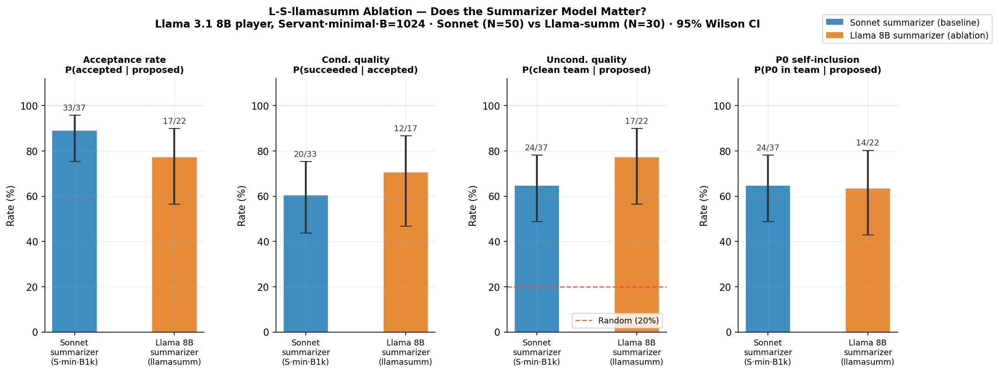

---

### Summary: proposal regret across all conditions

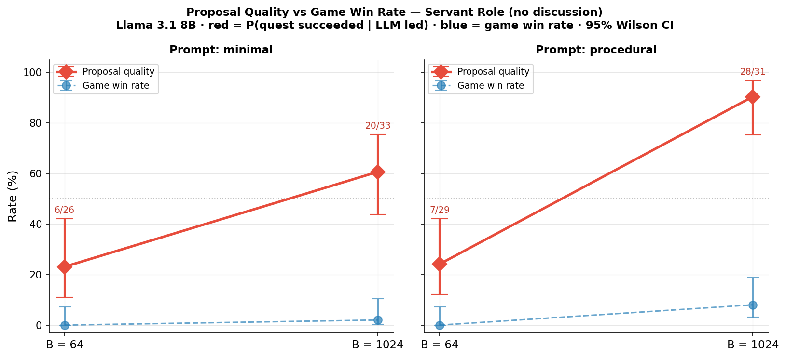

| Condition   | Budget | Proposals | Acc% | Uncond% | Cond% | Regret |
|-------------|--------|-----------|------|---------|-------|--------|
| S·min       | 64     | 37        | 70.3% | 45.9% | 23.1% | **54.1%** |
| S·min       | 1024   | 37        | 89.2% | 64.9% | 60.6% | **35.1%** |
| S·proc      | 64     | 38        | 76.3% | 42.1% | 24.1% | **57.9%** |
| S·proc      | 1024   | 40        | 77.5% | 92.5% | 90.3% |  **7.5%** |
| M·min       | 1024   | 19        | 94.7% | 94.7% | 94.4% |  **5.3%** |
| M·proc      | 1024   | 19        | 100%  | 94.7% | 94.7% |  **5.3%** |

The budget knob modulates proposal regret from 54% (B=64, minimal) down to 5–8% (B=1024, procedural or Merlin). Win rate is structurally capped near zero by the naive-bot voting dynamics and is not a useful signal here. The key findings:

1. **B=64 is incoherent (doesn't play at a "satisfying' level)**: the LLM proposes teams it then votes against (19% self-approval), explaining why cond_qual ≈ uncond_qual/2 at low budget.
2. **Procedural prompt × B=1024 unlocks near-zero regret**: the model follows the explicit reasoning scaffold when it has enough tokens to complete it.
3. **Merlin's information is used effectively**: Merlin and procedural Servant converge to the same proposal quality at B=1024, confirming the model reads and applies role knowledge.
4. **Discussion and summarizer quality are both relatively irrelevant** under the naive-bot structural constraint.

---

## Nim results (pilot, complete)

All experiments use Llama 3.1 8B Instruct, SGLang FP8, Nim [3,5,7], regex-constrained decoding. The theoretical random-play anchor is exactly **50.0%** (verified by game-tree recursion and N=100,000 Monte Carlo). We ran a sequence of experiments in a deliberate order — each one was motivated by an open question left by the one before it.

---

### Experiment 1 — Win rate vs budget (main sweep)

**Why we ran this.** This is the headline experiment of the whole project. We needed to know whether the budget knob `B` actually moves the win-rate needle at all. We played 30 games at each of five budgets against a random opponent — random is the right baseline because its win rate is exactly 50% by game-tree symmetry, giving us a clean anchor to test against. We also ran the same sweep against the NimOptimal agent (which always plays the nim-sum-correct move) to set an upper-bound ceiling: if the model ever wins against optimal play, it must have computed the strategy correctly at least once.

**What we learned.** The budget curve is flat. No single cell at N=30 is distinguishable from the 50% anchor — the confidence intervals are ±18 percentage points wide, and the point estimates zigzag around 50% with no upward trend. Against the optimal agent, the model wins 0 out of 132 games at B>0, with an upper CI bound of ~2%. Giving the model more tokens to think does not translate into better Nim play by any measurable amount at this sample size.

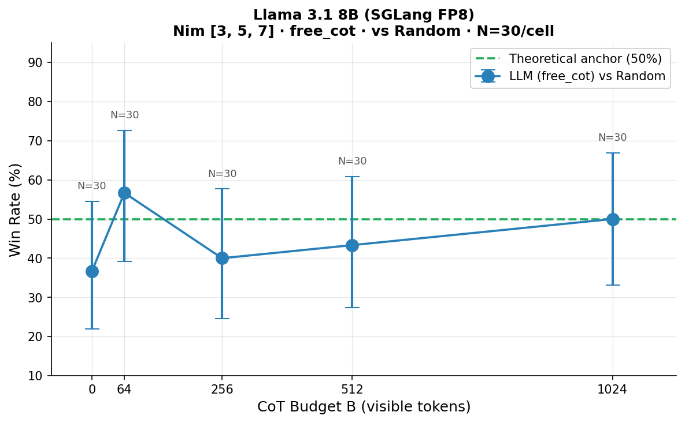

**Left:** free_cot vs random opponent, N=30/cell. No budget cell clears the 50% anchor — CIs are ±18 pp. **Right:** free_cot vs NimOptimal. The model wins 0 games at every budget above zero.

| Budget B | k/n | Win rate | 95% CI |
|----------|-----|----------|--------|
| 0 (random fallback) | 11/30 | 36.7% | [21.9%, 54.5%] |
| 64 | 17/30 | 56.7% | [39.2%, 72.6%] |
| 256 | 12/30 | 40.0% | [24.6%, 57.7%] |
| 512 | 13/30 | 43.3% | [27.4%, 60.8%] |
| 1024 | 15/30 | 50.0% | [33.2%, 66.8%] |

---

### Experiment 2 — Prompt variant comparison

**Why we ran this.** The flat budget curve left open the question of whether the model simply needed a better prompt. The nim-sum strategy is an explicit algorithm — XOR the pile sizes, then figure out which pile to reduce to bring the nim-sum to zero. Maybe the model just needs that algorithm handed to it. We tested four variants: free unstructured reasoning (`free_cot`), the nim-sum value given directly in the prompt (`nim_sum_given`), a step-by-step XOR procedure scaffolded in the system prompt (`step_by_step`), and a worked example of a complete game move (`few_shot`). N=30 per variant at B=1024.

**What we learned.** No variant moved the needle significantly. The most interesting result is `nim_sum_given` at exactly 50.0% — giving the model the correct XOR value directly does not help, which means the failure is not just in computing the XOR. The model also needs to invert it: given nim-sum=S and piles A,B,C, which pile do you reduce by how much to bring nim-sum to zero? That inverse mapping is a second failing step. `step_by_step` hit 70% at N=30, which looked promising, but the confidence interval included 50% (p=0.074) and the result did not survive replication at N=85 — see Experiment 3.

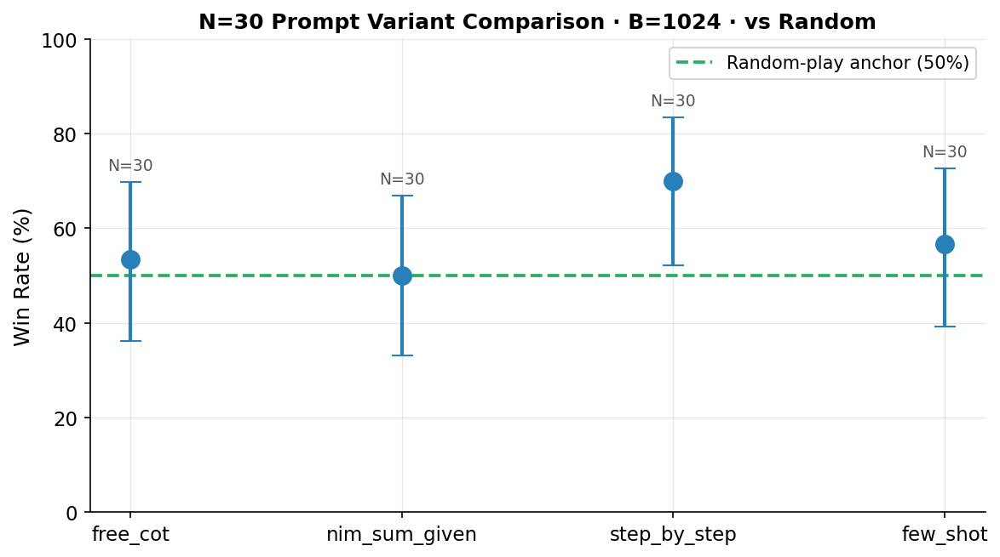

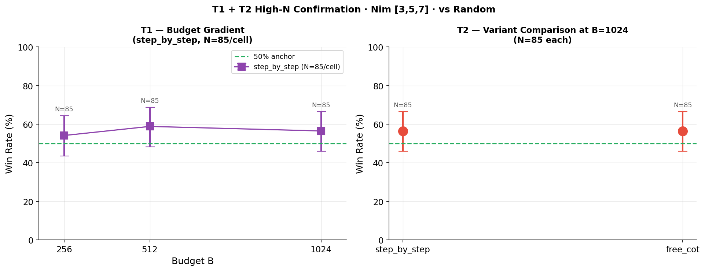

**Left:** N=30 variant comparison at B=1024. `step_by_step` reaches 70% but the CI is too wide to call it significant. **Right:** At N=85, the step_by_step budget gradient disappears and both variants converge to 56.5%.

| Variant | k/n | Win rate | 95% CI | p vs 50% |
|---------|-----|----------|--------|----------|
| `free_cot` | 16/30 | 53.3% | [36.4%, 69.6%] | ns |
| `nim_sum_given` | 15/30 | 50.0% | [33.2%, 66.8%] | ns |
| `step_by_step` | 21/30 | 70.0% | [52.1%, 83.3%] | ns (p=0.074) |
| `few_shot` | 17/30 | 56.7% | [39.2%, 72.6%] | ns |

---

### Experiment 3 — High-N replication (T1 and T2, N=85)

**Why we ran this.** N=30 gives ±18 pp confidence intervals, which is too wide to be confident in a 13 pp difference between variants. The `step_by_step` 70% result and a directional budget gradient within `step_by_step` (B=256→B=1024) could both be real signals or sampling noise — we needed more data to tell them apart. We chose N=85 because that gives 80% power to detect a 20 pp effect at p<0.05. T1 ran `step_by_step` at three budgets (B=256, 512, 1024) with N=85 each. T2 re-ran `step_by_step` and `free_cot` head-to-head at B=1024 with N=85.

**What we learned.** Both are negative. The budget gradient within `step_by_step` is flat — 54%, 59%, 56% across B=256, 512, 1024, none significantly different from each other or from 50%. The variant comparison is also flat: `step_by_step` and `free_cot` return identical point estimates (48/85 = 56.5% each). The N=30 step_by_step 70% was a lucky draw from a true rate closer to 57%.

| Condition | k/n | Win rate | 95% CI | p vs 50% |
|-----------|-----|----------|--------|----------|
| `step_by_step` B=256 | 46/85 | 54.1% | [43.6%, 64.3%] | ns |
| `step_by_step` B=512 | 50/85 | 58.8% | [48.2%, 68.7%] | ns |
| `step_by_step` B=1024 | 48/85 | 56.5% | [45.9%, 66.5%] | ns |
| `free_cot` B=1024 | 48/85 | 56.5% | [45.9%, 66.5%] | ns |

---

### Experiment 4 — Pooled binomial test

**Why we ran this.** Every individual cell is underpowered to detect a small effect. But we had 520 unique games across all conditions — if there is any consistent signal above 50%, pooling them gives enough power to detect it. This is the single cleanest claim we can make: does the model, under any deliberate-play condition, perform above chance?

**What we learned.** Yes, marginally. Across all 520 B>0 vs-random games (four variants, N=30 and N=85, duplicates excluded), the model wins 284/520 = 54.6%, with a 95% CI of [50.3%, 58.9%] and a one-sided p of 0.020. The effect is real but small — +4.6 pp above chance. It is consistent across all contributing groups; no single variant or budget level drives it. This is the weakest possible form of "above chance" and should not be over-interpreted: the model is not playing strategically, it just makes correct moves slightly more often than random.

> **284/520 = 54.6%** &nbsp; 95% CI [50.3%, 58.9%] &nbsp; one-sided p = **0.020**

---

### Experiment 5 — Phase-stratified mistake rate

**Why we ran this.** The pooled 54.6% is a game-level number. We wanted to know where inside the game the model's above-chance performance comes from — is it concentrated in the opening, middle game, or endgame? If the signal is phase-localised it tells us something about the mechanism. We split all winning-position turns (turns where a correct move existed) by game phase — early (turns 0–3), mid (turns 4–11), late (12+) — and measured the fraction the model blundered away.

**What we learned.** The result is striking: the model is actively worse than random in the early game (66% mistake rate, p<0.001) and essentially random in the mid-game (50%). Opening turns have the largest pile sizes — three piles of 3, 5, and 7 — which means the XOR arithmetic involves three multi-bit numbers and is at its most complex. As stones are removed and piles shrink, the arithmetic simplifies and the model's mistake rate drifts down to chance. Games on Nim [3,5,7] never reach the late phase (there are only 15 stones total). The pooled +4.6 pp win-rate elevation comes entirely from the mid-game, partially cancelling the early-game degradation.

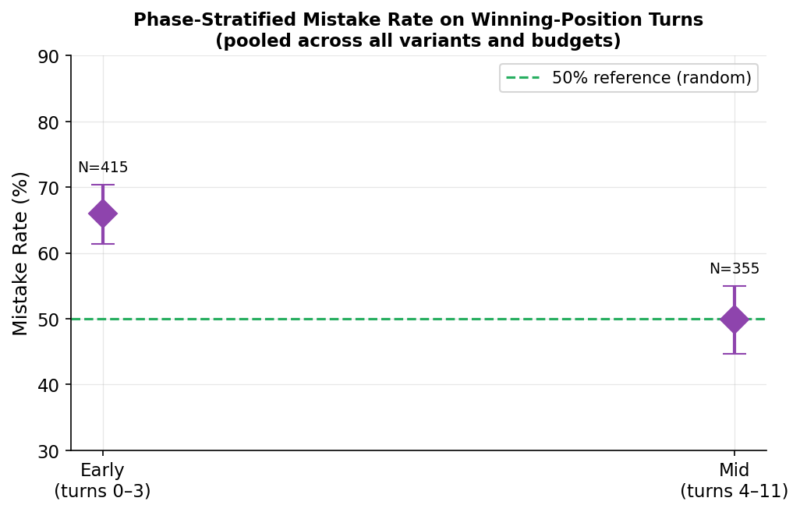

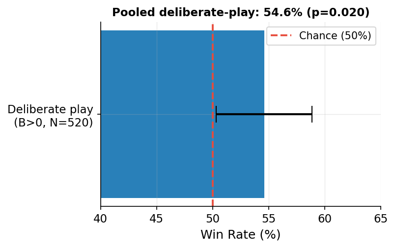

**Left:** Early game (turns 0–3): 66% mistake rate — worse than random because XOR is hardest when piles are full. Mid game (turns 4–11): 50% — indistinguishable from chance as arithmetic simplifies. **Right:** Pooled across all 520 deliberate-play games, the model sits at 54.6% with CI [50.3%, 58.9%], just clearing the 50% anchor.

| Phase | Mistakes/turns | Mistake rate | 95% CI | p vs 50% |
|-------|----------------|--------------|--------|----------|
| Early (turns 0–3) | 274/415 | **66.0%** | [61.3%, 70.4%] | p<0.001 |
| Mid (turns 4–11) | 177/355 | **49.9%** | [44.7%, 55.0%] | ns |
| Late (turns ≥12) | 0/0 | — | — | — |

---

### Experiment 6 — Win trace analysis

**Why we ran this.** The 54.6% pooled win rate raises a natural concern: maybe the model isn't actually winning because of good play. A random opponent makes mistakes too, and the model might simply be the last player standing after the opponent blunders enough games away. To check this, we went through all 73 wins the model achieved and asked: did the model actually have a winning position during that game, and did it choose the right move from it? If most wins contain no winning positions at all, the elevation is opponent-induced noise, not model skill.

**What we learned.** The wins are not purely opponent-induced, but they are also not deeply earned. Zero games were fully opponent-induced — every single win contained at least one winning position that the model correctly exploited. 95% of wins were partially earned (the model made at least one correct move from a winning position) and 5% were fully earned (every winning-position move was correct). More tellingly, the model's correct-move rate from winning positions is 53% in games it wins versus 21% in games it loses — a 32 pp gap. Wins genuinely correlate with better play. But 53% in winning games is barely above the 50% random baseline, confirming that the model gets lucky on a near-random mid-game move and the game tips from there, not that it is executing a coherent strategy.

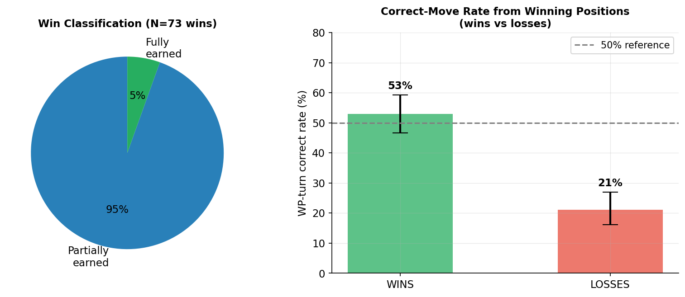

**Left:** Every win had at least one correctly exploited winning position — 0% were purely gifted by the opponent. **Right:** In winning games the model plays correctly from winning positions 53% of the time; in losing games, only 21%. The 32 pp gap shows wins and correct play are linked, but 53% is still barely above chance.

---

### Experiment 7 — Mechanism: reading the loss traces

**Why we ran this.** Aggregate win rates tell you that the model fails but not how. Two very different failure modes — "the model ignores strategy entirely" vs "the model knows the strategy but can't execute the arithmetic" — would both produce 0% wins against an optimal opponent. The fix for the first is a better prompt; the fix for the second is nothing we can do with a prompt. We read five B=1024 loss traces from games against the NimOptimal agent and annotated every reasoning step.

**What we learned.** The failure is arithmetic, not strategic. At every turn, without exception, the model: names the nim-sum algorithm, correctly identifies XOR as the operation, converts pile sizes to binary, and frames its goal as "find a move that sets nim-sum to zero." It is not ignoring the strategy. The failure is that it consistently gets the XOR wrong for mid-game pile sizes: `2 ⊕ 5 ⊕ 2 = 7` (correct answer: 5), `2 ⊕ 1 ⊕ 7 = 6` (correct: 4), `1 ⊕ 5 ⊕ 1 = 7` (correct: 5). Importantly, adding more tokens at B=1024 does not fix this — it only produces more text re-deriving the same wrong answer. The model cannot self-verify its own XOR computations. One trace also shows the model hallucinating a move that never happened, illustrating that multi-turn context tracking also degrades under pressure.

> **Strategy-known, arithmetic-failed.** The model names the nim-sum algorithm, writes binary representations, and frames the goal correctly at every turn. It fails because it consistently misevaluates `a XOR b XOR c` for mid-game pile configurations. For example: `2 ⊕ 5 ⊕ 2 = 7` (correct: 5), `2 ⊕ 1 ⊕ 7 = 6` (correct: 4). Longer CoT at B=1024 produces more reasoning tokens but the arithmetic remains wrong — the model cannot self-verify XOR computations. In one trace, the model hallucinates a game move that never occurred.

---

## Repository layout

```
src/cot_knob/
├── llm/         # LLMClient ABC + MockClient + OllamaClient + SGLangClient
├── games/       # Nim state + Reversi state + GameState protocol
├── agents/      # LLMAgent (two-pass: reason → constrained MOVE tag), UCTAgent
├── memory/      # FullHistoryMemory, LastMoveMemory
├── prompts/     # Nim prompt templates (free_cot, nim_sum_given, step_by_step, few_shot)
├── experiments/ # SweepConfig (pydantic), runner (single match), sweep (config-driven)
├── tracking/    # SQLite Store, JSONLWriter, analytics queries
└── analysis/    # plotting helpers
```

The serving backend lives entirely in `src/cot_knob/llm/`. Everything else is platform-agnostic. Swap `OllamaClient` for `SGLangClient` in configs; the game harness and sweep logic do not change.

---

## Where results live

- `data/results.db` — normalised SQLite source of truth (runs, trials, turns, model_calls)
- `data/runs/<run_id>/*.jsonl` — append-only per-trial event log (raw backup)
- `notebooks/06_nim_llama_sweep.ipynb` — main budget sweep analysis
- `notebooks/07_nim_diagnostics.ipynb` — variant, phase, mechanism, and pooled analyses

Schema reference: [`docs/tracking_schema.md`](docs/tracking_schema.md).

---

## Status and next steps

Nim is complete and serves as a **negative control**: on a task reducible to binary arithmetic, CoT budget and prompt structure add ~5 pp pooled but neither approaches optimal play. The budget knob does not modulate performance when the optimal strategy requires reliable symbolic execution.

 **Avalon** results are partial. We still need to
 * evaluate qualitatevly the results, especially the discussion cells we ran.
 * Rerun the experiments with intermediate budgets to see if the increase in performance, as measured by decision quality, monotonically increases $ B \in \{128, 256, 512\}$
 * Run more experiments with the bayesian bots, and not naive bots, to see if a "rational agent" is able to give the LLM more information on optimal strategy
 * Characterize the regret against "rational agent" bots
 * If possible, see if budget can control difficulty with a larger model Llama 70B (most likley out of scope due to budget constraints)
 * The position of the roles in the harness where fixed: these need to be rotated in the next runs


Items deferred from the Nim phase:
- **Reversi** — retained as a secondary game if Avalon results need a second data point
