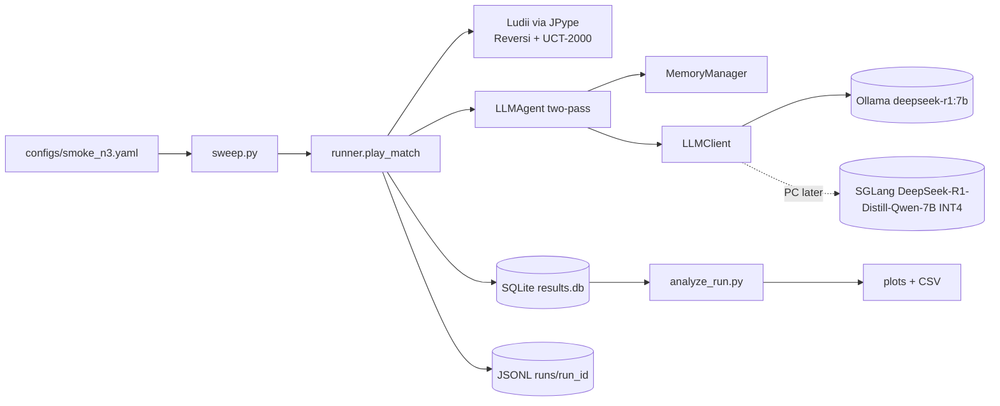

# Architecture

This document is the live design reference for the CoT-budget difficulty knob
harness. The original proposal lives at [docs/proposal.md](proposal.md); this
file tracks how we are *actually* building the system.

## Current vs target stack (May 2026)

The goals and the diagrams below describe the **target** Reversi/Ludii pipeline. The **current** active workstream is a Nim pilot on a different stack. Both are intentional — the Nim pilot validates the budget-knob methodology with a clean theoretical anchor before we re-engage the heavier Reversi/Ludii target.

| Concern | Current (active) | Target (proposal) |
|---|---|---|
| Primary game | **Nim [3,5,7]** (pure Python harness) | Reversi 8×8 (Ludii / JPype) |
| Primary model | **Llama 3.1 8B Instruct** via Ollama (`think=False`, single-pass) | DeepSeek-R1-Distill-Qwen-7B INT4 via SGLang (two-pass) |
| Opponent oracle | NimOptimal (Sprague-Grundy, exact) + uniform-random | UCT-2000 via Ludii |
| Status | Sweeps + diagnostics complete; results in [`nim_experiment_findings.md`](nim_experiment_findings.md) | Harness scaffolded; full sweeps pending |

The component diagram below depicts the target stack; substitute the **Current** column when reading it for now.

## Goals

1. Run a Reversi self-play harness against Ludii's UCT baseline with an
   LLM agent whose chain-of-thought (CoT) token budget `B` is the primary knob.
2. Keep the same code running on a Mac (development) and on an RTX 5090 box
   (production) by isolating the GPU-specific bits behind a single
   `LLMClient` interface.
3. Treat experiment outputs as data: every trial, turn, and model call lands
   in a normalized SQLite database with a JSONL backup on disk.

## Component overview

## Mac vs PC split

| Concern              | Mac (dev now)                            | RTX 5090 box (later)                              |
| -------------------- | ---------------------------------------- | ------------------------------------------------- |
| LLM serving          | Ollama HTTP, `deepseek-r1:7b` (Q4_K_M)   | SGLang HTTP, R1-Distill-Qwen-7B INT4 (or vLLM)    |
| Constrained decoding | Approximate (logprob scoring)            | SGLang `choices` operator                         |
| Concurrency          | Sequential, one game at a time           | Async batched (Task 2 in proposal)                |
| JVM / Ludii          | JPype + Ludii.jar (works on both)        | JPype + Ludii.jar                                 |

The seam between the two is `src/cot_knob/llm/`. Everything else
(`games/`, `agents/`, `memory/`, `tracking/`, `analysis/`) is platform-agnostic.

## UCT baseline strength (500 vs 2000 vs 10000)

The proposal uses **UCT-2000** as the primary *calibrated* opponent and
UCT-500 / UCT-10000 for adaptive-controller robustness. What to run in
practice:

- **UCT-2000** when you want a strong search line comparable to “many
  MCTS simulations per move” and care about absolute difficulty.
- **UCT-500** (or fewer iterations) when **win rate is 0% at every B** —
  the W(B) curve has no dynamic range. A weaker opponent yields measurable
  wins; you can still spot-check the same policy against UCT-2000 at a
  few B values later.
- **Choice is informed by:** wall-clock (more iterations → slower UCT
  turns), whether you need non-zero wins for bootstrap CIs, and whether
  you are studying *relative* budget effects (often easier with a softer
  baseline first).

Pass-1 **CoT budget B** is enforced by the backend’s max-new-tokens cap
(Ollama: `num_predict`). For thinking models, that cap applies to the
**total** of `thinking` + visible completion in one call. Validate runs
with `scripts/check_budget_enforcement.py <run_id>`. JSONL `turn`
events include `pass1_finish_reason` / `pass2_finish_reason` (`stop` vs
`length`, etc.).

## Literature: rough expectations at ~7B

These are **not** Reversi-specific numbers but set calibration:

- **GameBench** (Costarelli et al., 2024, [arXiv:2406.06613](https://arxiv.org/abs/2406.06613)):
  GPT-3.5-class models sit near **random** on many obscure strategy
  games; GPT-4 + CoT improves but stays **below human**. CoT can **hurt**
  smaller models on some games.
- **GTBench** (Li et al., 2024, [arXiv:2402.12348](https://arxiv.org/abs/2402.12348)):
  against **MCTS** with enough simulations in complete deterministic
  games, LLMs are reported as **non-competitive** (wins are rare). A
  strong **UCT-2000** local baseline is in the same spirit.

**Takeaway:** DeepSeek-R1-Distill-7B can still lose most games to UCT-2000
while you debug prompts and memory; that is **not** by itself evidence
that the budget knob is broken. Weaken UCT or increase N before judging
monotonicity of W(B).

## RTX 5090 (sm_120) compatibility note

The original proposal targeted RTX 5080 + Quadro RTX 6000 (sm_75). The
production target is now RTX 5090 (Blackwell, sm_120). As of early 2026,
SGLang has known issues with INT4 / GPTQ-marlin kernels on sm_120 — see
sgl-project/sglang issues #15043 and #20670, and PR #17331.

Implications:

- Validate SGLang on the 5090 box first; do *not* assume the proposal's
  serving config works as-is.
- Keep an SGLang→vLLM fallback path. vLLM has more mature sm_120 support
  for INT4 dense models; it fits behind the same `LLMClient` interface.
- Prefer NVFP4 over INT4 if available — NVFP4 is the Blackwell-native
  quantization format.

This is *not* a today problem. It is a "do not get surprised in a few weeks"
note.

## Move-quality metrics (oracle evaluation)

Every turn — **for both the LLM agent and the UCT opponent** — is evaluated
by a dedicated **UCT-2000 oracle** that is independent of the game opponent's
strength. This lets us compare LLM and UCT-10 (or any opponent) on the same
quality axis rather than only comparing win rates.

Metrics stored per turn in the `turns` table and JSONL:

| Field | Description |
|---|---|
| `uct_top3_json` | Full oracle ranking of all legal moves (`[{move, visits, win_rate}, …]`), sorted best-first |
| `move_quality` | 1 if chosen move is in oracle top-3, else 0 |
| `move_regret` | `oracle_winrate(best_move) − oracle_winrate(chosen_move)` — continuous, lower = better |
| `oracle_chosen_rank` | Rank of chosen move in full oracle ordering (1 = best) |
| `n_legal_moves` | Branching factor at this turn — normalizes rank comparisons |
| `oracle_iters_used` | UCT iterations used for oracle eval (default 2000) |

Because both agents are evaluated, analysis queries can directly compare:
- `SELECT agent_kind, AVG(move_regret) … GROUP BY agent_kind, budget_B`
- Normalized rank percentile: `oracle_chosen_rank * 1.0 / n_legal_moves`

UCT-10 (near-random) typically has high regret (≈0.10–0.15), providing a
concrete floor. A stronger LLM at high B should sit above this floor.

## SQLite tracking schema

See [tracking_schema.md](tracking_schema.md) for the canonical schema reference.
Headline tables: `runs`, `trials`, `turns`, `model_calls`, `summaries`,
`controller_decisions`. Every write happens inside a single transaction per
turn so a crashed run leaves the DB consistent.

## What is intentionally deferred

The proposal lists 13 tasks; the bootstrap delivers the spine for all of
them but only fills in tasks 1 and (a small N=3 version of) task 3.
Deferred:

- Cross-game asyncio batching (Task 2)
- Confound isolation experiments (Task 4) — `FillerAgent` is stubbed
- Memory ablation (Task 5)
- Model size / prompt baselines / structured CoT ablation (Tasks 6–8)
- Reasoning content labeling (Task 9) — schema is ready, UI is not
- Adaptive controller (Task 10)
- Avalon (Task 13)

The `LLMClient` and `Store` interfaces are designed so each of these can
be added without touching the harness core.

In practice, several of these deferred items have *partial* analogues in the
Nim pilot — e.g. structured-CoT ablation lives in [§8 of the Nim findings](nim_experiment_findings.md#8-diagnostic-results-may-2026)
as the `step_by_step` / `nim_sum_given` / `few_shot` variants. They will need
to be re-run on the target stack before the deferred-task list can be checked
off.
