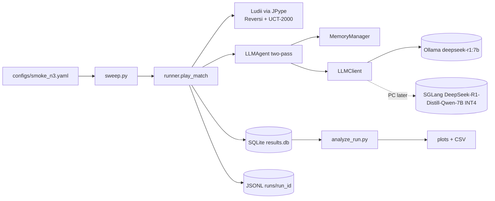

# Architecture

This document is the live design reference for the CoT-budget difficulty knob
harness. The original proposal lives at [docs/proposal.md](proposal.md); this
file tracks how we are *actually* building the system.

## Goals

1. Run a Reversi self-play harness against Ludii's UCT baseline with an
   LLM agent whose chain-of-thought (CoT) token budget `B` is the primary knob.
2. Keep the same code running on a Mac (development) and on an RTX 5090 box
   (production) by isolating the GPU-specific bits behind a single
   `LLMClient` interface.
3. Treat experiment outputs as data: every trial, turn, and model call lands
   in a normalized SQLite database with a JSONL backup on disk.

## Component overview

## Mac vs PC split

| Concern              | Mac (dev now)                            | RTX 5090 box (later)                              |
| -------------------- | ---------------------------------------- | ------------------------------------------------- |
| LLM serving          | Ollama HTTP, `deepseek-r1:7b` (Q4_K_M)   | SGLang HTTP, R1-Distill-Qwen-7B INT4 (or vLLM)    |
| Constrained decoding | Approximate (logprob scoring)            | SGLang `choices` operator                         |
| Concurrency          | Sequential, one game at a time           | Async batched (Task 2 in proposal)                |
| JVM / Ludii          | JPype + Ludii.jar (works on both)        | JPype + Ludii.jar                                 |

The seam between the two is `src/cot_knob/llm/`. Everything else
(`games/`, `agents/`, `memory/`, `tracking/`, `analysis/`) is platform-agnostic.

## RTX 5090 (sm_120) compatibility note

The original proposal targeted RTX 5080 + Quadro RTX 6000 (sm_75). The
production target is now RTX 5090 (Blackwell, sm_120). As of early 2026,
SGLang has known issues with INT4 / GPTQ-marlin kernels on sm_120 — see
sgl-project/sglang issues #15043 and #20670, and PR #17331.

Implications:

- Validate SGLang on the 5090 box first; do *not* assume the proposal's
  serving config works as-is.
- Keep an SGLang→vLLM fallback path. vLLM has more mature sm_120 support
  for INT4 dense models; it fits behind the same `LLMClient` interface.
- Prefer NVFP4 over INT4 if available — NVFP4 is the Blackwell-native
  quantization format.

This is *not* a today problem. It is a "do not get surprised in a few weeks"
note.

## SQLite tracking schema

See [tracking_schema.md](tracking_schema.md) for the canonical schema reference.
Headline tables: `runs`, `trials`, `turns`, `model_calls`, `summaries`,
`controller_decisions`. Every write happens inside a single transaction per
turn so a crashed run leaves the DB consistent.

## What is intentionally deferred

The proposal lists 13 tasks; the bootstrap delivers the spine for all of
them but only fills in tasks 1 and (a small N=3 version of) task 3.
Deferred:

- Cross-game asyncio batching (Task 2)
- Confound isolation experiments (Task 4) — `FillerAgent` is stubbed
- Memory ablation (Task 5)
- Model size / prompt baselines / structured CoT ablation (Tasks 6–8)
- Reasoning content labeling (Task 9) — schema is ready, UI is not
- Adaptive controller (Task 10)
- Avalon (Task 13)

The `LLMClient` and `Store` interfaces are designed so each of these can
be added without touching the harness core.
